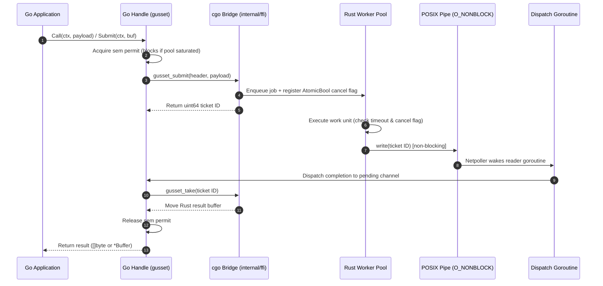

# Gusset: Agent Hand-off

As of 2026-09-20. Author: Bharath Chandra. Living copy: https://claude.ai/code/artifact/101473c0-1589-4016-bab8-721261a7912e

Working brief for any agent developing or maintaining Gusset, the Go–Rust runtime contract. Phases 0 (Seed Reproduction), 1 (v0.1 Core Runtime), and 2 (Second-App Validation) are shipped; Phase 3 (Public Release) is ready; Phase 4 (Out-of-Process IPC) is specified in `docs/ipc.md`. The design plan is in `docs/PLAN.md`; resolved decisions are in `DECISIONS.md`; audit history is in `CHANGELOG.md`.

## Mission and working rules

Gusset is the runtime contract for running a Rust engine inside a Go service: the layer between "bindings exist" and "this runs in production without taking the Go process down." It owns the panic firewall, bounded concurrency, deadlines, poisoned handles, ABI verification, allocator accounting, and the CI matrix that proves them. It does not own type marshalling, cgo-free calling, or IPC transport.

How an agent works in this repo:

1. Every change is a merge with green CI on the full matrix; no "will fix in a follow-up" on a red gate.
2. A new failure mode gets a test in the panic zoo or pitfall suite before the fix lands; the test must fail on `main` first.
3. Numbers in the README come from `benchstat` output checked into `bench/results/<platform>-<go>-<rust>.txt`, never typed by hand (`make docs` generates via `tools/benchdoc`, `make docs-check` verifies).
4. Public surface stays at 14 exported Rust functions (the list in the specifications is the whole ABI) and 11 Go entry points (`WaitBuffer` is the eleventh; `DECISIONS.md` 2026-09-20). Adding another needs a line in `DECISIONS.md` saying why.
5. Anything that touches Go runtime internals (`//go:linkname`, `asmcgocall`, private symbols) is refused, whoever asks.
6. When a Go or Rust release changes boundary behaviour, the fix is a version-gated code path plus a test, not a raised floor.
7. Prefer deleting a feature over adding a knob; every config option must have a test that exercises both settings.
8. Commit messages state which invariant (I1–I6 in `docs/PLAN.md`) the change protects.

## Toolchain policy

Develop on the latest stable of both languages; support latest and latest-minus-one; use nightly and tip only for gates, never for shipped code. As of 2026-09-20 that is Go 1.27 (August 2026) and Rust 1.98.1 (3 September 2026).

| Channel | Go | Rust | Used for |
| --- | --- | --- | --- |
| Develop and release | 1.27.x | 1.98.x | Everything shipped; `go.mod` says `go 1.26`, `rust-version = "1.97"` |
| Supported floor | 1.26 | 1.97 | CI leg; a floor bump is a minor release with a changelog line |
| Gates only | gotip (weekly job) | nightly (pinned by date, bumped monthly) | Go tip catches boundary changes early; nightly runs Miri, `-Zsanitizer=address`, `cargo-fuzz` |
| Never | anything below 1.22 | anything below 1.81 | 1.22 introduced `#cgo noescape`/`nocallback`; 1.81 made panics escaping `extern "C"` abort |

Release-note facts to design around: Go 1.26 cut baseline cgo call overhead by about 30% and made the Green Tea GC default, so re-run `bench/` on every Go minor and never hard-code a nanosecond figure in docs; Go 1.26 randomizes the heap base on 64-bit builds, so any test that assumes pointer values is invalid; Go 1.26 added a scheduler thread metric; Go 1.27's `runtime/metrics` catalogue publishes it as `/sched/threads/total:threads` (the 1.26 notes named `/sched/threads:threads`), which is the thread-cap soak's assertion source; Go 1.27 made the `goroutineleak` pprof profile GA, which the completion-channel tests use to prove no waiter is leaked.

## Runtime differences and how Gusset handles each

The two runtimes disagree on lifetime, failure, threads, clocks, atomics and types. Four rows (lifetime, failure, cancellation, clocks) changed the design from the first draft.

| Difference | Go | Rust | Gusset handling |
| --- | --- | --- | --- |
| Object lifetime | GC-managed; `runtime.AddCleanup` (1.24+) runs later, on one goroutine, non-deterministically; an object whose last use is a cgo argument may be collected during the call | RAII: `Drop` runs deterministically at scope end | Explicit `Close` is the contract; `AddCleanup` is a leak backstop that logs and frees; `runtime.KeepAlive(h)` after every cgo call on the handle |
| Heap movement and input ownership | Heap objects never move; stacks grow and shrink, but not while the goroutine is in a cgo call | Nothing moves | Go pointers valid for the call only; submit copies inputs up to 4 KiB, larger inputs live in Rust-owned `Buffer`s that Go fills through `unsafe.Slice` (R16); anything else retained means copy or `runtime.Pinner` unpinned in the same function (R6) |
| Memory accounting | `GOMEMLIMIT` sees the Go heap only | Global allocator, no limit, no visibility | `Counting<A>` wrapper, `Stats()`, `AdviseMemoryLimit` |
| Failure model | `panic` recoverable per goroutine, no poisoning; runtime fatals (thread exhaustion, `cgocheck`) unrecoverable | Panic unwinds; escaping `extern "C"` aborts (1.81+); `Mutex` poisoning; `abort()` uncatchable | `catch_unwind` around each **work unit in the worker loop**, not only the submit call; the loop survives; a dead worker is respawned; a ticket whose result is `FFI_PANIC` poisons the handle; abort is out of scope (Phase 4 isolation) |
| Threads | Goroutines are M:N, migrate between OS threads, preempted by signal; cgo runs on the g0 stack | 1:1 OS threads, stable TLS, own stack size | Rust-owned pool per handle with explicit stacks; no thread-identity assumptions (R7); `LockOSThread` only in adopter code that needs it |
| Blocking | A cgo call is a syscall to the scheduler: M pinned, P handed off after ~20 µs, not counted in `GOMAXPROCS`, does not block STW; thread cap 10,000 | Blocking is just blocking | Submit-and-return keeps every call under the hand-off threshold; waits park on the netpoller via the completion pipe; semaphore bounds in-flight (R11) |
| Cancellation | `context.Context`, cooperative through channels | Dropped futures, or cooperative checks | Each job owns an `AtomicBool` cancel flag in Rust memory; Go sets it with `gusset_cancel(handle, ticket)` (one cgo call); `Close` sets all of them with `gusset_cancel_all`; Rust checks the flag between work units; Rust never reads Go-owned memory |
| Clocks | `time.Now()` monotonic reading is process-internal; macOS and Linux sources differ from Rust's | `Instant` from `CLOCK_MONOTONIC` or `mach_absolute_time` | Header carries a **relative** `timeout_ns` computed at submit; Rust builds its own `Instant`; absolute monotonic values never cross; wall-clock only for trace timestamps |
| Memory model and atomics | `sync/atomic` is sequentially consistent; 64-bit alignment rules on 32-bit targets | Acquire/Release orderings; no cross-language memory model exists | Nothing is shared by address except Rust-owned memory reached through exported functions; all cross-boundary values are copied into the header; the completion pipe is the only signal path |
| Types | `int` is platform-sized; no unions; strings immutable and not validated UTF-8; `error` is an interface | Fixed-width ints; only `#[repr(C)]` is stable; `u128`, fat pointers, most `Option<T>` are not FFI-safe; `str` must be valid UTF-8 | Header and status use `i32`, `u32`, `u64`, `usize` and thin pointers only; `#![deny(improper_ctypes_definitions)]`; `str::from_utf8` with `FFI_BAD_ARG` on failure, never `_unchecked`; Go exposes `*gusset.Error{Code, Msg, File, Line}` for `errors.Is` |
| Integer overflow | Wraps silently | Panics in `dev`, wraps in `release` | Explicit `wrapping_*` and `checked_*` in `ffi/`; panic zoo and pitfalls run in both profiles |
| Zero values | Everything zero-initialized | Uninitialized until written | Out params written with `ptr::write` only on `FFI_OK`; Go reads `out` only on `FFI_OK` |
| Async | Blocking-style goroutines | Poll-based Tokio | No runtime inside a cgo call; an async engine runs one Tokio runtime on a pool thread; submit = `spawn` + oneshot, completion through the same pipe |
| Signals | Go owns every handler and requires `SA_ONSTACK` from foreign code; a thread without an alternate stack dies on stack overflow before any handler runs | `std` installs neither handlers nor `sigaltstack` in a `staticlib` | Rust never installs handlers; each worker installs a 64 KiB `sigaltstack` in its entry function; `EINTR` retried in `ffi/` |
| Process exit | `os.Exit` skips defers and never runs Rust `Drop`; tests share one process | Statics never dropped; threads killed at exit | `gusset_shutdown(drain_ms)` from app shutdown and `TestMain`; nothing durable relies on `Drop` |
| Logging | `slog`/`fmt` on Go's side; Rust cannot call back | `log`/`tracing` on Rust's side | Rust subscriber writes into a bounded ring; Go drains it with `gusset_drain_logs` into `slog`; stderr fallback |
| Build profiles | One profile | `dev` has overflow checks and `debug_assertions` | CI runs the full pitfall suite in both `dev` and `release` |

## Hard rules for the boundary

Each rule names the test or lint that enforces it. A PR that cannot point at the enforcer for a rule it touches is not mergeable.

| # | Rule | Enforced by |
| --- | --- | --- |
| R1 | Every exported Rust function is `pub unsafe extern "C"`, does nothing but call `ffi_guard`, and is one of the 14 names in `ffi/exports.txt` | `tests/exports_match.rs` diffs `nm` output against the list |
| R2 | No panic crosses the boundary; the Cargo profile is `panic = "unwind"` for every profile including `test` and `bench` | `build.rs` reads `CARGO_CFG_PANIC` and fails the build on `abort`; panic zoo tests |
| R3 | Strings and buffers cross as `(ptr, len)`; no `CString`, no NUL termination, no `unwrap` in any error path | `clippy.toml` disallowed-methods: `CString::new`, `Option::unwrap`, `Result::unwrap`, `expect` in `ffi/` |
| R4 | Memory is freed by the side that allocated it, through an exported `*_free`; Go never calls `C.free` on Rust memory | `gussetvet` rejects the call outside `tests/cgoprobe` on every commit (comment-stripping, with an explicit allowlist — a blanket `grep` matched prose about the rule and fired on its own enforcer's source); `TestR4_CrossFreeIsDetectedUnderASan` in the nightly ASan job proves the mismatch is detected at runtime |
| R5 | Every `#cgo` import of a Rust export carries `#cgo noescape` and `#cgo nocallback`; no export calls back into Go | `go vet` custom analyzer `gussetvet` in `tools/` |
| R6 | Go pointers passed to Rust are valid only for the duration of the call; anything Rust retains is copied or pinned with a `runtime.Pinner` that is unpinned in the same Go function | `GOEXPERIMENT=cgocheck2` job; the pinner test |
| R7 | Rust never stores a Go pointer, never calls a Go function, and never assumes two calls arrive on the same OS thread; no `thread_local!` in `ffi/` or job code | `clippy.toml` disallowed-macros: `thread_local!` in `ffi/` and `pool/`; the thread-migration test documents the hazard |
| R8 | Heavy work runs on Rust-spawned threads with explicit `stack_size`; the cgo call only submits and returns | `worker_stack_is_explicitly_sized_not_inherited` reads the size back off the worker that ran the job, so it fails on any platform if the explicit sizing is dropped; the musl job runs the deep-recursion unit where the 128 KiB default is actually in play. The recursion probe alone proves the platform, not the runtime: on glibc and darwin the default is already 8 MiB |
| R9 | Every submission carries the 40-byte header (`trace_id[16]`, `span_id[8]`, `timeout_ns` relative to submit, `flags: u32`, `reserved: u32`); Rust turns `timeout_ns` into an `Instant` at submit and checks it and the job's cancel flag between work units | Deadline test and cancel test with a slow work unit; header size static-asserted at 40 |
| R10 | A handle whose ticket returned `FFI_PANIC` is poisoned; all later calls return `FFI_POISONED` without entering Rust | Poison test; `Handle.Close` is the only way out |
| R11 | In-flight calls per handle never exceed the pool size; the Go semaphore, not the OS, does the queuing | Thread-cap soak asserts `/sched/threads/total:threads` stays under pool size + `GOMAXPROCS` + 8 |
| R12 | Go `init()` compares `gusset_abi_layout()` (version, size and alignment of every `#[repr(C)]` type) against compiled-in constants and panics on mismatch | ABI-drift test bumps a field and expects the panic |
| R13 | No `//go:linkname`, no `asmcgocall`, no `purego` in this repo; the only calling path is cgo | CI grep; a PR touching it is closed |
| R14 | Exactly one Rust `staticlib` per Go binary; adopters with several engines build an umbrella crate | Documented in README; the example engine shows the pattern |
| R15 | Every number in docs is generated: `bench/` output via `benchstat`, committed per platform and toolchain version | `make docs` regenerates and CI diffs |
| R16 | Rust never retains Go memory after `gusset_submit` returns: inputs up to 4 KiB are copied during submit; larger inputs are written by Go into Rust-owned `Buffer`s (`gusset_buf_alloc`/`gusset_buf_free`, exposed as `[]byte` via `unsafe.Slice`) and submitted by id; results come back through `gusset_take` or as a `Buffer` (`WaitBuffer`) | `cgocheck2` job; large-input test asserts 0 Go allocs and no extra copy; ASan job |

## Pitfall catalogue

Every row is a test name in `tests/pitfalls/`; the agent adds a row when it finds a new one, never fixes silently.

| Pitfall | Symptom | Cause | Guard |
| --- | --- | --- | --- |
| NUL byte in a panic message | `SIGABRT`, whole Go process gone | `CString::new(..).unwrap()` panics inside the `catch_unwind` `Err` arm; second panic unwinds out of `extern "C"` | R3; `panic_nul` test (reproduced in `bench/seed`) |
| `panic = "abort"` in a dependency or profile | Firewall silently becomes a no-op | `catch_unwind` cannot catch an abort | R2 `build.rs` check |
| `*out = value` on the Ok path | UB when `T: Drop` | Assignment drops the uninitialized old value | `ptr::write` only; clippy lint `gusset::assign_through_raw` |
| Thread exhaustion | Fatal `thread exhaustion`, not a recoverable error | Goroutines blocked in cgo each pin an M; cap is 10,000 | R11; soak test; `/sched/threads/total:threads` alert |
| Goroutine migrates between calls | `thread_local!` state vanishes; Tokio `Handle::enter` guard on the wrong thread; `errno` lost | Go schedules goroutines onto any M between cgo calls | R7; stateless submissions; `runtime.LockOSThread` only in the example that needs it |
| musl 128 KB thread stack | Stack overflow as a raw SIGSEGV in Go's handler | cgo-created threads inherit the pthread default; musl's is 128 KB | R8; musl job |
| Rust stack overflow reported by Go | `unexpected signal during runtime execution`, no Rust frame | A `staticlib` never runs `std::rt::init`, so Rust's overflow handler is absent | R8; Go owns SIGSEGV; each worker installs its own `sigaltstack` in its entry function, because std only does that for Rust binaries, not staticlibs |
| `SIGURG` preemption signal interrupts a Rust syscall | Sporadic `EINTR` from C deps inside Rust | Go 1.14+ async preemption signals hit the thread regardless of what it runs | Retry loop around any raw syscall in `ffi/`; `std` already retries |
| Two heaps, one limit | OOM-killed with a small Go heap | `GOMEMLIMIT` cannot see Rust allocations | `Counting<A>` + `Stats()` bridge; memory-limit test |
| Go pointer retained by Rust | `cgocheck` fatal, or silent corruption after GC | Rust stored a pointer past the call | R6, R16; `cgocheck2` job |
| Duplicate Rust `std` symbols | Link error `rust_eh_personality` defined twice | Two `staticlib`s in one binary | R14; umbrella crate |
| Windows toolchain mismatch | Unresolved symbols at link | cgo uses mingw; Rust built for `-msvc` | Target `x86_64-pc-windows-gnu`; CI leg |
| macOS dylib signing | `dyld` refuses to load under hardened runtime | Unsigned or ad-hoc dylib | Static link by default; dylib path only in docs |
| `uniffi-bindgen-go` needs `LD_LIBRARY_PATH` | Works in dev, fails in a container | Dynamic loading by default | Gusset example shows static link with generated bindings |
| rust2go's `GODEBUG=invalidptr=0,cgocheck=0` | Silent GC corruption under load | Disables the checks that make R6 enforceable | Never set these; CI fails if `GODEBUG` contains either |
| purego / `asmcgocall` trampolines | Works until the next Go minor; P pinned, GC STW blocked for the call | Runtime internals, no `entersyscall` | R13 |
| Batching through a channel | Amortization never materializes | A channel send costs about one cgo call, and the two have stayed within 5% of each other across a toolchain and architecture change: 56 ns vs 64 ns on x86-64 Linux, 17.62 ns vs 18.43 ns on darwin/arm64 | Batch only slices that already exist at the call site; `BenchmarkChannelHop` in `bench/seed/go/ffi_test.go` measures it, and `bench/seed/README.md` tabulates both platforms |
| Pointer passed without `noescape` | 1 heap alloc per call, GC pressure | cgo assumes escape by default | R5; `-benchmem` gate at 0 allocs/op |
| `_test.go` cannot use cgo | Tests fail to compile | cgo forbidden in test files | All cgo lives in `internal/ffi`; tests call Go wrappers |
| Stale `.a` not rebuilt | Old Rust code linked | Go's build cache does not track the archive | `go generate` writes the archive hash into a Go file; CI uses `go build -a` |
| `unsafe.String` over mutable Rust memory | UB, corrupted strings | Go assumes string bytes are immutable | `unsafe.Slice` + copy to `string` when retaining |
| Deadline cannot cancel a running call | Caller hangs past its timeout | Nothing can interrupt a cgo call from Go | R9; deadline enforced between work units in Rust |
| Heap base randomization (Go 1.26) | Tests asserting pointer ranges flake | Security feature, on by default | Never assert on addresses |
| Green Tea GC timing (Go 1.26) | Race that only shows on new GC | Different marking order | `GOGC=1` job; `-race` job |
| Untrusted input selects a panic | A payload whose first byte is 1, 2 or 3 panics the engine and poisons the handle | The built-in diagnostic engine picks behaviour from `input[0]` and ran by default whenever no adopter engine was registered — which is every process that has not yet called `set_engine_handler`, since no C export does | Fail closed with `no engine handler registered`; diagnostic engine gated behind `GUSSET_FLAG_DIAGNOSTIC_ENGINE`; `TestHardening_UntrustedInputCannotSelectPanic` sweeps all 256 first bytes |
| Adopter cannot link the published module | `ld: library 'gusset' not found` on any `go get` of this module | `#cgo LDFLAGS` resolve `target/release`, which `.gitignore` excludes from the module zip and which is read-only in the module cache | `-tags gusset_pkgconfig` or `CGO_LDFLAGS=-L…`; `docs/adoption.md`; both paths verified against a module-cache layout |
| Umbrella crate produces the wrong archive name | R14's umbrella crate builds, but cgo still reports `library 'gusset' not found` | cgo links `-lgusset`, so the output file must be `libgusset.a` — `[lib] name`, not `[package] name` | Documented in `docs/adoption.md`; the DevCouncil umbrella sets `[lib] name = "gusset"` |
| `Wait` outlives its context | A caller passes an unknown or already-awaited ticket and parks forever, deadline and all | `Wait` registered any ticket in `pending`, then blocked unconditionally on a completion that was never coming; a second `Wait` also displaced the first waiter's channel | `ErrUnknownTicket` / `ErrTicketBusy`; `TestAdversarial_WaitOnUnknownTicketRespectsContext`, `TestAdversarial_DoubleWaitOnSameTicketDoesNotOrphan` |
| fat-LTO archive is opaque to `nm` | The export check passes having read no symbols at all | `lto = "fat"` emits LLVM bitcode; a system `nm` from an older LLVM prints `Unknown attribute kind (105)` to stderr, exits 0, and produces empty stdout | `exports_match` prefers the toolchain's `llvm-nm`, inspects every archive present, and fails when a reader cannot parse one |
| Descriptor double-close on a failed open | `close()` on a descriptor the caller still owns, shutting whatever unrelated file inherited that number | `Handle` took the write fd at construction, so an `open` failing after the `Arc` existed ran `Drop` → `close` → `close(fd)` | Ownership published only on success and reclaimed with a swap; `descriptor_ownership_transfers_only_on_successful_open`, `TestAdversarial_HandleChurnDoesNotLeakDescriptors` |
| Unbounded pool size | `WithPoolSize(1<<20)` requests a million OS threads with 8 MiB stacks | The argument fed straight into `thread::Builder::spawn` with no ceiling | `MAX_POOL_SIZE = 1024`, refused not clamped; `open_rejects_pool_size_above_maximum`, `TestHardening_PoolSizeIsBounded` |
| Log ring discards everything on overflow | Every buffered diagnostic vanishes exactly when something has gone wrong; one oversized line grows the buffer past its cap without limit | Overflow called `buf.clear()` and then appended the new line whole, however large | Evict oldest whole lines, truncate an oversized line on a char boundary; `log_ring_evicts_oldest_and_stays_bounded` (pre-fix it stored 500,001 bytes in a "64 KiB" ring) |
| Panic-location map grows without bound | Memory growth and an O(n) scan on every panic, in a library built for panic-heavy workloads | Entries were keyed by `ThreadId` and removed only by the panicking thread itself; panics nobody claimed left entries behind, and `ThreadId`s are never reused | Capped at 256 with oldest-first eviction, degrading to "unknown location" and never to a wrong one; `panic_locations_stay_bounded_across_unclaimed_panics` |
| A `#[repr(C)]` type outside the ABI check | `gusset_alloc_stats` writes `AllocStats` into Go memory at the wrong offsets and nothing notices | `AbiLayout` covered three types; `AllocStats` was the fourth crossing the boundary | ABI version 2 covers four types, plus a cgo-vs-Rust cross-check because `gusset.h` is hand-maintained; `TestPitfall_ABILayoutMatch` |
| A CI gate that can never pass | The lint job is red on every commit, so nobody reads it | `! grep -rn "//go:linkname" . --exclude-dir=.git` matched this file, `docs/PLAN.md`, and the workflow's own text | Audit scoped to tracked `*.go`/`*.rs` via `git ls-files`, verified to both pass clean and still detect a planted match |
| Allocator double counting | `Stats().Live` reports every `Buffer` at twice its size, and `AdviseMemoryLimit` subtracts it twice from the Go heap budget | `RawBuffer` recorded its allocations by hand *and* allocated through the global allocator, which `Counting` had already counted | `record_alloc`/`record_dealloc` no-op once `Counting` is active; `accounting_is_balanced_saturating_and_peak_monotonic` |
| `ErrTicketBusy` released the owner's permit | A second `Wait` on a live ticket returned `ErrTicketBusy` and then consumed the semaphore slot, so a third `Submit` entered while the job was still running | `waitInternal` deferred `releaseSem` on every return, including the busy and unknown-ticket paths | Release only after this call has taken ownership of the wait; `TestPitfall_DoubleWaitDoesNotReleaseSemaphore` |
| Failed submit leaked `in_flight` | `gusset_shutdown` waited out its drain budget because a cancel flag outlived a send that never queued | Flag inserted, then sender looked up; a gone sender returned `Err` and left the flag | Lock the sender first; insert only if it is live; remove on send failure; `submit_does_not_leave_a_cancel_flag_when_the_sender_is_gone` |
| `WaitBuffer` copied `JobResult::Ok` onto the Go heap | A 64 KiB result allocated ~66 KiB/op in Go even through `WaitBuffer` | `drainPipe` copied take()'s Rust buffer into a Go slice and freed it; `WaitBuffer` then allocated a second Rust buffer and copied again | Keep the take buffer until a waiter consumes it; `WaitBuffer` wraps with no Go copy; `TestPitfall_WaitBufferDoesNotCopyTakeAllocation` |
| FFI cancel is not a context error | `GOGC=1` cancel-storm failed: `unexpected error ... cancelled: DeadlineExceeded` | `Error.Is` matched only another `*Error` by code, so `errors.Is(err, context.DeadlineExceeded)` was false when the worker finished the cancel before Go's `ctx.Done` won | `Error.Is` maps `cancelled: DeadlineExceeded` / `cancelled: Explicit`; `TestPitfall_FFICancelMapsToContextErrors` |
| `Wait` copies a take view after `Close` | `GOGC=1` `TestStress_ConcurrentCallAndCloseRace`: `corrupted Buffer response` with a torn first cache line | `drainPipe` keeps large results as a Rust `take()` slice; `Wait` copied it without `cgoMu`, and `Close` `HandleClose`d the memory under the copy | Copy under `cgoMu.RLock` so `HandleClose` waits; closed handle returns an error instead of a partial slice |
| Panic hook swallowed Rust test failures | `cargo test` reported FAIL with no panic message | `install_panic_hook` replaced libtest's hook and recorded the location without printing | Chain the previous hook after recording; `adopter_engine_runs_and_displaces_the_diagnostic_engine` now prints the induced panic |
| Eager `*Buffer` wrap taxed `Wait` | `Wait` of a 64 KiB take buffer allocated 6 objects/op (HEAD was 3) | `drainPipe` wrapped the take buffer so `WaitBuffer` could steal it, then `Wait` copied and destroyed the wrapper | Wrap at `WaitBuffer` consume time; `Wait` copies and `BufFree`s; `TestPitfall_WaitOfLargeTakeBufferDoesNotPayWrapperAllocs` |
| Nil `context.Context` aborted the caller | `Call`/`Submit`/`Wait` panicked on `ctx.Done()` and took the goroutine down | Context was assumed non-nil, which is a Go convention, not a library firewall | Reject with `gusset: nil context`; `TestPitfall_NilContextIsRejected` |
| `WithPoolSize` truncated through `uint32` | `WithPoolSize(1<<40)` opened a 0-capacity semaphore (every `Call` hung); `WithPoolSize(1<<32+4)` silently became 4 workers | `uint32(n)` ran before the `MaxPoolSize` check, so values that do not fit in 32 bits never saw the ceiling | Refuse n outside 1..=MaxPoolSize before conversion; `TestPitfall_PoolSizeOverflowIsRefusedNotTruncated` |
| `[]byte` over 4 KiB copied on the cgo thread | A 1 MiB `Call` memcpy'd inside `gusset_submit` and pinned an M for the copy | R16 was documented, not enforced; `Handle::submit` inlined every slice | Refuse inline input `> 4096`; larger payloads use `NewBuffer`; `TestPitfall_InlineSliceOver4KiBIsRefused` |
| `NewBuffer` after a caught panic | Allocations still entered Rust on a poisoned handle | R10 covered Submit/Call; `buf_alloc` did not check the latch | `ErrPoisoned` on Go and in `gusset_buf_alloc`; `TestPitfall_NewBufferRefusesPoisonedHandle` |
| Kernel blocking on full pipe write | A worker thread blocked indefinitely in `libc::write`, rendering `WRITE_TICKET_TIMEOUT` dead code | `pipe(2)` returns blocking descriptors by default; saturated completion pipes hung the worker pool | Enforce `O_NONBLOCK` on `pipe_write_fd` in `Handle::open` and Go `Open`; worker retries with exponential backoff up to 2.5s |
| Submit/Close race on semaphore drain | Close released permits before an in-flight submit registered its ticket, leaking permits or deadlocking | Semaphore permit was acquired before `s.cgoMu.RLock()`, leaving a gap where Close drained tickets | Extended `s.cgoMu.RLock()` to cover `semTickets` insertion; post-semaphore poison fast-fail |
| Buffer use-after-free during concurrent Close | `buf.Bytes()` indexed memory already released by Rust if `Close` ran concurrently | Go race detector cannot observe Rust-owned heap memory | `buf.Bytes()` checks handle closed state and returns nil; double `Buffer.Free` idempotent |
| Diagnostic opcode 6 recursion overflow | Recursion depth read directly from payload (`[6, 0xFF, ...]`) panicked worker thread via stack overflow | Recursive probe frames were unbounded by user payload | Capped recursion depth at boundary; `TestPitfall_DeepRecursionOnWorkerStack` verifies safe limit |
| `WaitBuffer` of a large take result races `Close` | Success wrapping a slice whose `Bytes()` is already over freed pages, or a torn view | `Wait` copied take views under `cgoMu`; `WaitBuffer` wrapped after `waitInternal` returned. The 3-byte close-race copied onto the Go heap and never took this path | Wrap under `cgoMu.RLock`; closed handle returns an error; `TestPitfall_WaitBufferOfLargeResultDoesNotDangleAcrossClose` |
| Large `JobResult::Ok` memcpy on cgo thread | A 64 KiB diagnostic echo pinned an M inside `gusset_take` for the copy | Take allocated a fresh `RawBuffer` and `ptr::copy_nonoverlapping` on the calling thread | Worker promotes `Ok` > 4 KiB to `Buffer` before writing the ticket; `large_ok_result_is_promoted_off_the_cgo_thread` |
| Unbounded `NewBuffer` length | `NewBuffer(1<<40)` asked the OS for more memory than the process can hold | Length fed straight into `posix_memalign` with no ceiling | `MAX_BUFFER_BYTES = 1 GiB`, refused not clamped; `TestPitfall_BufferSizeIsBounded`, `allocate_refuses_above_maximum_without_touching_the_allocator` |
| Overflowing `timeout_ns` disables the deadline | `timeout_ns = u64::MAX` ran until cancel or completion | `Instant::checked_add` `None` was stored as "no deadline", the same as `timeout_ns == 0` | Overflow expires immediately; `nonzero_timeout_always_installs_a_deadline` |

## Hardened runtime specifications

The core architecture guarantees and technical contracts enforced across the Rust crate, Go package, and build system.

### Rust crate (`crates/gusset`)

- **Compiler gates**: `#![deny(unsafe_code, unsafe_op_in_unsafe_fn, improper_ctypes_definitions, missing_docs)]` crate-wide, with `#[allow(unsafe_code)]` restricted to `ffi` and `pool::sys`.
- **ABI surface**: Exactly 14 exports (`gusset_abi_layout`, `gusset_init`, `gusset_shutdown`, `gusset_handle_open`, `gusset_handle_close`, `gusset_submit`, `gusset_take`, `gusset_cancel`, `gusset_cancel_all`, `gusset_status_free`, `gusset_alloc_stats`, `gusset_drain_logs`, `gusset_buf_alloc`, `gusset_buf_free`). Verified against `internal/ffi/exports.txt` via `llvm-nm`.
- **Four `#[repr(C)]` struct layouts**: Statically asserted for size and alignment (`CallHeader` 40B, `FfiStatus` 48B, `AbiLayout` 36B for ABI v2, `AllocStats` 24B).
- **FFI firewall (`ffi_guard`)**: Null-checks out pointers, uses `ptr::write` for outputs, wraps `Display` formatting in nested `catch_unwind`, maps `Ok(Err)` to `FFI_ERR` and `Err(payload)` to `FFI_PANIC`. Error messages allocated in boxed slices freed only via `gusset_status_free`.
- **Panic hook & diagnostic tracking**: Installed once in `gusset_init`; records panic location into a 256-entry capacity-capped map with oldest-first eviction.
- **Worker pool**: Fixed size per handle from `gusset_handle_open` (capped at 1024); threads spawned via `Builder::stack_size` (8 MiB explicit stack) named `gusset-w<N>`. Each thread installs a 64 KiB `sigaltstack` on entry and loops with `catch_unwind` around work units; dead workers are respawned on subsequent submissions.
- **Cancellation & deadlines**: Monotonic relative `timeout_ns` translated into Rust `Instant` at submit; a non-zero value whose `checked_add` overflows expires immediately rather than becoming "no deadline". Cooperative checks between work units evaluate both deadline and per-job `AtomicBool` cancel flag (with `Ordering::Acquire`).
- **Pipe completion**: Non-blocking `pipe_write_fd` writes 8-byte ticket IDs on job completion; retries on `EINTR`/`EAGAIN` with exponential backoff up to 2.5s.
- **Memory accounting & buffers**: 64-byte aligned allocations via `gusset_buf_alloc`/`gusset_buf_free`, refused above 1 GiB. `Counting<A: GlobalAlloc>` wrapper with relaxed atomics tracks live and peak allocations with zero allocations inside `gusset_alloc_stats`. Workers promote `JobResult::Ok` larger than 4 KiB onto a `Buffer` so `gusset_take` does not memcpy on the cgo thread.
- **Build profile**: `panic = "unwind"` crate-wide enforced by `build.rs`; frame pointers enabled (`-C force-frame-pointers=yes`); hand-maintained `internal/ffi/gusset.h` verified against Rust signatures by parameter and return types in `tests/header_match.rs`.

### Go package (`gusset`)

- **cgo boundary encapsulation**: All cgo confined to `internal/ffi`; public API in root package; `_test.go` files never import `C`. Every `#cgo` import carries `#cgo noescape` and `#cgo nocallback` (enforced by `tools/gussetvet`).
- **11 public entry points**: `Open`, `Close`, `Call`, `Submit`, `Wait`, `WaitBuffer`, `NewBuffer` (with `Buffer.Free`), `Stats`, `AdviseMemoryLimit`, `Threads`, `DrainLogs`.
- **Handle lifecycle & concurrency**: Bounded semaphore channel matching pool size; `poisoned` atomic bool; non-blocking completion pipe read by a dedicated dispatch goroutine; `AddCleanup` finalizers backstop forgotten handle and buffer closures.
- **Zero-copy egress & multi-engine routing**: `WaitBuffer` transfers take buffer directly into Go `*Buffer` without intermediate heap copies. Engine opcodes dispatched via `CallHeader.reserved` field (`WithOpcode`/`ContextWithOpcode`).
- **Input validation & memory limits**: Submissions copy inputs up to 4 KiB; inputs above 4 KiB require `Buffer`. A single buffer is refused above 1 GiB (`MaxBufferBytes`). `AdviseMemoryLimit(total)` feeds Rust live memory usage back into Go runtime `debug.SetMemoryLimit`.
- **ABI verification**: Go `init()` validates `gusset_abi_layout()` version, sizes, and alignments against compiled constants and panics on mismatch.

### Build, link and platform targets

- **Platform targets**: Unix-only by construction (enforced via `compile_error!` on non-unix targets). Cross-compilation verified for `x86_64-unknown-linux-gnu`, `aarch64-unknown-linux-gnu`, `x86_64-unknown-linux-musl`, and `aarch64-apple-darwin`. CI asserts Windows refuses build.
- **Static linking**: `libgusset.a` linked directly. Umbrella crates for multi-engine consumers must set `[lib] name = "gusset"`. Downstream modules link via `-tags gusset_pkgconfig` or `CGO_LDFLAGS`.
- **Build cache invalidation**: `go generate ./internal/ffi` writes SHA256 archive hash into `internal/ffi/archive_hash.go`.

## Repo layout and architecture

```
gusset/
  Cargo.toml              # workspace: gusset, gusset-example
  crates/gusset/          # runtime crate: ffi/, pool/, alloc/, header/
  crates/gusset-example/  # reference adopter engine exercising all failure modes
  go.mod                  # module github.com/bharathvbcr/gusset
  gusset.go handle.go stats.go buffer.go  # public API (11 entry points)
  internal/ffi/           # cgo bridge, hand-maintained gusset.h, exports.txt
  tools/gussetvet/        # custom go vet analyzer enforcing R4 & R5
  tools/benchdoc/         # benchstat-driven README generator
  bench/                  # Go benchmarks & committed benchstat results
  tests/pitfalls/         # living pitfall & adversarial test suite
  tests/panic_zoo/        # 5-case uncatchable panic reproduction suite
  .cargo/config.toml      # frame pointers, target configuration
  clippy.toml deny.toml   # strict linting and license rules
  DECISIONS.md CHANGELOG.md AGENTS.md docs/PLAN.md
  .github/workflows/      # matrix.yml, nightly.yml, tip.yml
```

### Request execution lifecycle



## Testing plan

Three workflows: `matrix.yml` on every PR, `nightly.yml` daily, `tip.yml` weekly. A red job blocks merge; nightly and tip failures open an issue automatically.

| Job | Workflow | Platform | Command / setting | Must contain | Status |
| --- | --- | --- | --- | --- | --- |
| `unit` | matrix | linux, macos | `cargo test --workspace`, `go test ./...` | Panic zoo (5 cases), ABI drift, poison, deadline, cancel, thread migration, completion drain, runtime hardening suite, shutdown drain, adopter engine, header signature diff | live — 27 Rust tests, plus Go pitfall/panic-zoo suite |
| `cgocheck2` | matrix | linux | `GOEXPERIMENT=cgocheck2 go test ./...` | Pinner test; a retained-pointer violation that must be caught | live. `TestGate_CgoCheck2IsArmedWhenRequested` stores a Go pointer into C memory in a subprocess and asserts it is caught *with* the experiment and allowed *without* it |
| `race-gc` | matrix | linux, macos | `go test -race`, then `GOGC=1 go test -count=5` | Completion reader vs `Close`; concurrent `Call` on one handle | live (`-count=5`) |
| `soak` | matrix | linux, macos | `go test -run Soak -timeout 20m` | 10,000 goroutines on a 4-worker pool; `/sched/threads/total:threads` under 4 + `GOMAXPROCS` + 8; `goroutineleak` profile empty after drain | live. `TestSoak_GoroutineLeakProfileIsEmptyAfterDrain` uses Go 1.27's real `goroutineleak` profile and fails if unavailable |
| `memlimit` | matrix | linux | `GOMEMLIMIT=256MiB` | `Stats().Live` within 1% across a 200 MiB Rust allocation; `AdviseMemoryLimit` subtracts it | live. `TestMemLimit_LiveStatsTrackLargeRustAllocation` allocates 200 MiB in 20 MiB chunks; measured drift is 0.0000% |
| `musl` | matrix | linux (`golang:1.27-alpine`) | Static build, deep-recursion unit, worker stack read-back | Passes only because work runs on Rust threads with 8 MiB stacks | live. Uses Alpine container. R8 additionally verified platform-independently via `pool::sys::current_thread_stack_size` read-back |
| `cross` | matrix | linux | `make cross` (`cargo check` per target) | Every supported target compiles; Windows fails with declared error | live. Unix-only enforced by `compile_error!`. See `docs/platforms.md` |
| `bench` | matrix | linux, macos | `go test -bench . -count=10 \| benchstat` vs merge base; `make docs-check` | Regression over 10% fails; README numbers are generated | live. `tools/benchdoc` regenerates README from benchstat, `-check` fails on drift |
| `lint` | matrix | linux | `clippy --all-targets -D warnings`, `cargo fmt`, `gofmt`, `gussetvet`, `staticcheck`, `govulncheck`, `cargo deny`, forbidden-pattern audit | Exports list matches symbol table of every archive present; header signatures match Rust | live. Audit scoped to tracked files via `git ls-files`; clippy checks `--all-targets`; header diff verifies signatures |
| `asan` | nightly | linux | `RUSTFLAGS=-Zsanitizer=address` + Rust suite; `go test -asan` for cross-free | Cross-free detected; everything else clean | live. `TestR4_CrossFreeIsDetectedUnderASan` detects double-free under ASan |
| `miri` | nightly | linux | `cargo miri test -p gusset --lib` (non-FFI modules) | Header, alloc counting | live. Runs 7 core unit tests (`pool` tests carry `#[cfg_attr(miri, ignore)]`) |
| `fuzz` | matrix | linux | `make fuzz` (Go native fuzzing) | Call boundary, diagnostic engine, buffer lifecycle | live. 4.56M execs on refusal path, 178K against diagnostic engine, 0 crashers |
| `tip` | tip | linux | `gotip` + Rust beta | Full `unit` + `soak`; failure opens an issue tagged `toolchain` | live. Issue step reuses open `toolchain` issue |

Panic zoo cases (all return `FFI_PANIC`, process alive, message and location populated): `&str` payload; `String` payload; non-string payload (`panic_any(42)`); NUL byte in message; panic inside error's `Display` impl.

Property the whole suite proves: no test in this repo ever needs `GODEBUG=cgocheck=0` or `invalidptr=0`; CI greps for both and fails.

## Borrow and avoid

| Project | Borrow | Avoid |
| --- | --- | --- |
| rust2go (https://github.com/ihciah/rust2go) | The `drop_safe` idea for parameter ownership; precomputed buffers for nested types; its honesty about Go-side deep copies | Manual-assembly Go callbacks; `GODEBUG=invalidptr=0,cgocheck=0`; Rust-as-driver orientation |
| uniffi-bindgen-go (https://github.com/NordSecurity/uniffi-bindgen-go) | The interop target: Gusset's example shows generated bindings sitting on top of the runtime contract; their `RustBuffer` (ptr, len, capacity) shape | Dynamic loading default; tracking uniffi's version churn inside Gusset |
| purego (https://github.com/ebitengine/purego) | The `CGO_ENABLED=0` container story as a documented alternative for adopters who need it | Any dependency on it; runtime internals |
| Stoolap driver (https://stoolap.io/blog/2026/04/08/calling-a-rust-library-from-go-with-cgo-disabled/) | Their framing that the engine, not the boundary, dominates real workloads; benchmark discipline | `asmcgocall`; P pinned for the call; the `fakecgo` TLS shim |
| iceoryx2 (https://github.com/eclipse-iceoryx/iceoryx2) | Service discovery and lifecycle model for Phase 4; their tiered platform-support table as a README pattern | Reimplementing their transport |
| Gaultier's cgo notes (https://gaultier.github.io/blog/addressing_cgo_pains_one_at_a_time.html) | C in separate files so warnings work; `zig cc` static musl builds; getters instead of unions; `go build -a` when the archive changes | Inline C in Go comments |
| Arcjet (https://blog.arcjet.com/calling-rust-ffi-libraries-from-go/) | Wrapper crate over the real engine; `cbindgen` in `build.rs`; `cargo-zigbuild` | Their three-language maintenance drift; their wazero migration is the right call for them, not for GPU work |
| Tokio | Cancellation-by-flag instead of dropped futures across FFI; named worker threads | Running a Tokio runtime inside a cgo call (`block_on` trap) |
| Go `net` package | `os.Pipe` so waits park on the netpoller | Blocking reads on a raw fd |
| Hystrix / resilience4j | Bulkhead semantics for the semaphore; poison equals an open circuit | Retries at the boundary; the Rust side decides idempotency |

## Phase status and hand-off protocol

| Phase | Target | Status | Milestone evidence |
| --- | --- | --- | --- |
| 0 Seed | Repro firewall failure; baseline benchmarks | **SHIPPED** | `rs_guarded_doc` failed with `SIGABRT` under NUL byte; Gusset hardened firewall catches it safely; baseline benchmarks committed in `bench/results/` |
| 1 v0.1 | Core runtime, 6 invariants, 14 exports, CI matrix | **SHIPPED** | R1–R16 enforcers in place; 14 exports diffed via `llvm-nm`; ABI layout v2 cross-checked; full matrix green |
| 2 Second app | Adopter validation in second codebase | **SHIPPED** | Validated in DevCouncil (`go_orchestrator` driving `dc-glob`) and `crates/gusset-example` with zero public surface expansion |
| 3 Public | Package publishing, generated docs, example engine | **READY** | `benchdoc` automation committed; `gusset.pc` pkg-config support; staticlink recipe in `docs/adoption.md` |
| 4 IPC | Out-of-process daemon for GPU crash isolation | **SPECIFIED** | Shared memory transport architecture with upstream `iceoryx2` specified in `docs/ipc.md` |

Hand-off checklist for any agent session:

- Read this file and `DECISIONS.md`; do not reopen a decided item without a new entry in `DECISIONS.md`.
- Run `make ci-local` (build, test, lint, docs-check, bench smoke) before committing changes.
- Every newly observed failure mode must get a reproduction test in `tests/pitfalls/` and a corresponding row in the pitfall catalogue.
- Numbers quoted in documentation must come directly from `bench/results/` via `benchstat` (`make docs`), never typed manually.
- End the session with `CHANGELOG.md` updated and all invariants (I1–I6) verified.

## Sources

- Go 1.27 release notes (https://go.dev/doc/go1.27) and Go 1.26 release notes (https://go.dev/doc/go1.26): cgo overhead cut, Green Tea GC, heap base randomization, `/sched/threads:threads`, `goroutineleak`
- Rust release history (https://endoflife.date/rust): 1.98.1 stable as of 3 September 2026
- rust2go (https://github.com/ihciah/rust2go) and its design write-up (https://en.ihcblog.com/rust2go/)
- uniffi-bindgen-go (https://github.com/NordSecurity/uniffi-bindgen-go)
- iceoryx2 (https://github.com/eclipse-iceoryx/iceoryx2): bindings and platform tiers
- Stoolap: calling a Rust library from Go with cgo disabled (https://stoolap.io/blog/2026/04/08/calling-a-rust-library-from-go-with-cgo-disabled/)
- Addressing cgo pains, one at a time (https://gaultier.github.io/blog/addressing_cgo_pains_one_at_a_time.html)
- Arcjet: calling Rust FFI libraries from Go (https://blog.arcjet.com/calling-rust-ffi-libraries-from-go/)
- Seed measurements in `bench/seed/README.md`
