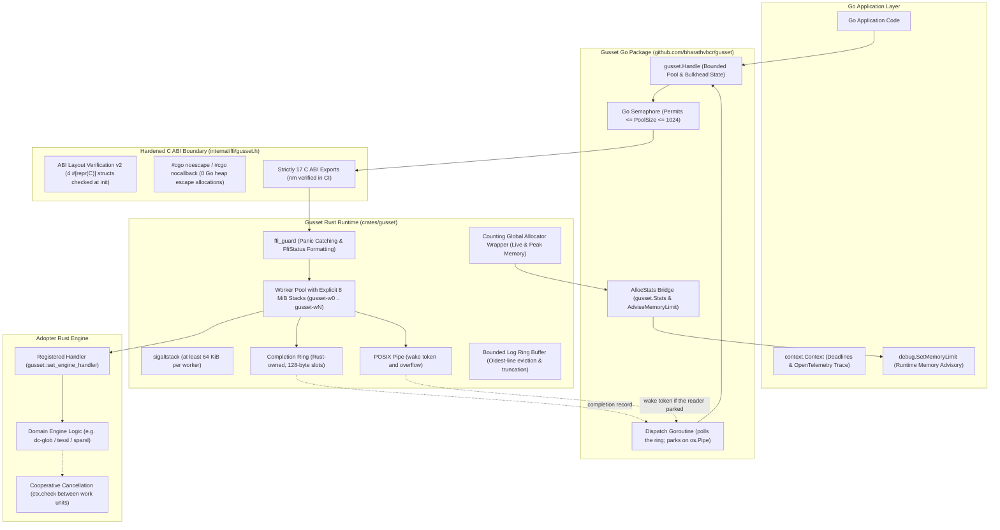
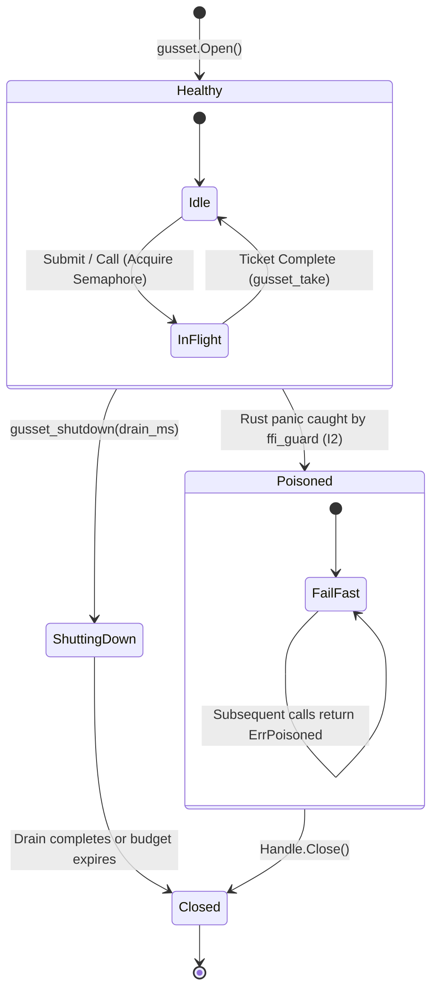
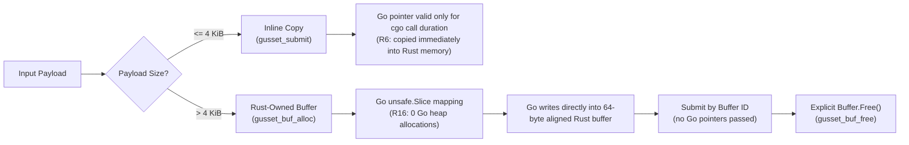

# Gusset

[](https://gusset.vbcr.dev/)

The runtime contract for running a Rust engine inside a Go service: panic firewall, bounded concurrency, deadlines, poisoned handles, ABI verification, allocator accounting, and the CI matrix that proves them.

Gusset is **not** a binding generator, **not** a cgo-free calling path, and **not** an IPC transport. It is the hardening plate between Go and Rust in production.

> **Why Gusset?** Foreign Function Interface generators (`cgo`, `cbindgen`, `uniffi`) solve type marshalling, but leave the process vulnerable to thread exhaustion (>10k threads), musl 128 KiB stack overflows in Docker, double-panic `SIGABRT` aborts, and container OOM kills. See [Why Gusset is Needed](docs/why.md) for the complete engineering rationale and runtime collision analysis.

---

## Architecture



---

## Core Invariants

1. **(I1) Memory Ownership:** Memory is freed by the allocator that created it via exported `*_free` functions. Go never calls `C.free` on Rust memory.
2. **(I2) Panic Firewall:** No Rust panic crosses the FFI boundary. A caught panic poisons the handle; subsequent calls fail fast with `ErrPoisoned`.
3. **(I3) Deadline & Cancellation:** Deadlines and cancellations are enforced inside Rust between work units using relative `timeout_ns` and per-job `AtomicBool` flags.
4. **(I4) Bounded Concurrency:** In-flight calls per handle never exceed the configured pool size. Callers park on the Go semaphore, never on an OS thread in cgo. Pool size is capped at `gusset.MaxPoolSize` (1024); a larger request is refused, not clamped. On Linux the completion pipe is grown to hold one inline record per worker, or one 8-byte ticket per worker when it cannot, and `Open` is refused only when even the tickets will not fit. `Open` attaches a completion ring by default, so steady-state records live there and the pipe carries wake tokens and overflow.
5. **(I5) Rust-Owned Stacks:** Heavy Rust work runs on Rust-spawned threads with an explicit 8 MiB stack, never on the caller's g0 stack (musl's default is 128 KiB). Each worker installs its own guard-paged `sigaltstack` (at least 64 KiB, larger where the kernel's signal frame needs it) so Go's signal handler can run on a Rust thread, and a failure to do so is logged rather than silently accepted. The alternate stack does not make a stack overflow survivable: the process still exits. Workers also block SIGPIPE, so a write to a closed pipe returns EPIPE instead of killing the process.
6. **(I6) ABI Verification:** Go `init()` verifies ABI version, struct sizes, alignments, and the offset and size of every named field against Rust before the process starts serving — for all four `#[repr(C)]` types that cross the boundary, `AllocStats` included.

---

## Execution & Completion Lifecycle

Gusset decouples work submission from thread-blocking cgo calls. Callers wait on a Go channel. The dispatch goroutine polls the completion ring and parks on the netpoller only when it is idle.

```mermaid
sequenceDiagram
    autonumber
    actor Caller as Go Goroutine
    participant Handle as gusset.Handle
    participant Sem as Semaphore (Channel)
    participant CGO as C ABI (internal/ffi)
    participant Pool as Rust Worker Pool
    participant Ring as Completion Ring
    participant Pipe as POSIX Pipe (os.Pipe)
    participant Reader as Dispatch Goroutine

    Caller->>Handle: Call(ctx, input)
    Handle->>Sem: Acquire permit (pool bounded)
    Note over Sem: Callers queue in Go runtime (never pin OS thread in cgo - I4)
    Handle->>CGO: gusset_submit(handle, header, input, &ticket)
    Note over CGO: 40-byte CallHeader (relative timeout_ns + trace/span IDs)
    CGO->>Pool: Enqueue job to worker queue
    CGO-->>Handle: Return ticket ID immediately
    Handle->>Handle: Register ticket channel in pending map

    par Rust Worker Execution
        Pool->>Pool: Worker dequeues job
        Note over Pool: Runs under catch_unwind (I2) with explicit 8 MiB stack (I5)
        Pool->>Pool: ctx.check() (timeout & cancel flag)
        Pool->>Pool: Execute registered engine
        Pool->>Ring: Publish completion record (inline when the success is ≤ 48 bytes)
        opt Reader has parked
            Pool->>Pipe: Write one wake token (8 zero bytes)
        end
    and Reader
        Handle->>Reader: Await ticket on Go channel or ctx.Done()
        alt Ring has a record
            Ring-->>Reader: Atomic load; no system call
        else Reader is idle
            Pipe-->>Reader: Netpoller wakes reader on the token
        end
        Reader->>Handle: Dispatch completion to ticket channel
    end

    alt Small inline success
        Note over Handle: Bytes already in the record; no gusset_take
    else Larger result, error, or panic
        Handle->>CGO: gusset_take(handle, ticket, &out, &len)
        Note over CGO: Result moved out exactly once
        CGO-->>Handle: Return result bytes
    end
    Handle->>Sem: Release semaphore permit
    Handle-->>Caller: Return ([]byte, nil)
```

### Bulkhead & Panic Poisoning State Machine

When foreign Rust code panics, Gusset acts as a production bulkhead. The worker thread survives, the panic is caught and formatted into an `FfiStatus`, and the handle latches into a permanently `Poisoned` state so subsequent submissions fail-fast without re-entering native code.



### Dual-Path Memory Model (R6 & R16)

To respect Go's garbage collector and cgo pointer-passing rules, Gusset employs a dual-path input ownership model:



---

## Installation

### One-Command Install
Install Gusset runtime library, C headers, pkg-config definition, and `gussetvet` linter:
```bash
curl -fsSL https://raw.githubusercontent.com/bharathvbcr/gusset/main/install.sh | bash
```

### Local / From Source
```bash
git clone https://github.com/bharathvbcr/gusset.git
cd gusset
make install
```
By default, this installs into `~/.local` (or `/usr/local` if run with write permissions or as root). Custom prefix can be provided via `PREFIX=/path/to/prefix make install`.

---

## The Public Surface

### 17 Exported Rust Functions
Gusset exports strictly 17 C ABI functions from `libgusset.a` (enforced by `tests/exports_match.rs`):
- `gusset_abi_layout(out)`: Layout and struct size/alignment verification.
- `gusset_abi_fields(offsets, sizes, cap)`: Named-field offsets and sizes of all `#[repr(C)]` types.
- `gusset_init()`: Global runtime initialization and panic hook installation.
- `gusset_shutdown(drain_ms)`: Graceful shutdown and worker drain.
- `gusset_handle_open(pool_size, pipe_write_fd, out_handle, status)`: Opens bounded worker pool.
- `gusset_handle_close(handle, status)`: Closes handle, cancels tasks, and closes write fd.
- `gusset_handle_ring(handle, out_ring, out_shared, out_slots, out_capacity, status)`: Attaches the completion ring. Optional for a C host; `Open` calls it. The ring outlives `gusset_handle_close`.
- `gusset_ring_release(ring)`: Drops the reader's reference to that ring.
- `gusset_submit(handle, header, input_ptr, input_len, buffer_id, out_ticket, status)`: Submits work unit.
- `gusset_take(handle, ticket, out_buf_id, out_ptr, out_len, status)`: Moves result out once.
- `gusset_cancel(handle, ticket, status)`: Cancels specific job ticket.
- `gusset_cancel_all(handle, status)`: Cancels all pending jobs on handle.
- `gusset_status_free(status)`: Frees Rust-allocated error message.
- `gusset_alloc_stats(out)`: Non-allocating allocator accounting export.
- `gusset_drain_logs(buf, len, out_written)`: Drains log ring buffer.
- `gusset_buf_alloc(handle, len, out_id, out_ptr, status)`: Allocates 64-byte aligned Rust buffer.
- `gusset_buf_free(handle, id, status)`: Frees Rust-owned buffer.

### 12 Go Public Entry Points
- `gusset.Open(opts ...Option) (*Handle, error)`
- `(*Handle).Close() error` — cancels, then **joins** the pool. Its latency is whatever the engine still has left to do; see `gusset.Shutdown` for the budgeted half.
- `(*Handle).Call(ctx context.Context, in []byte) ([]byte, error)`
- `(*Handle).CallBuffer(ctx context.Context, in *Buffer) (*Buffer, error)` — the zero-copy round trip. `Call` refuses `[]byte` over 4 KiB, so the payloads zero-copy is for are the ones it cannot carry.
- `(*Handle).Submit(ctx context.Context, in any) (uint64, error)`
- `(*Handle).Wait(ctx context.Context, ticket uint64) ([]byte, error)` (and `WaitBuffer` for zero-copy egress)
- `(*Handle).NewBuffer(n int) (*Buffer, error)` (with `(*Buffer).Free() error`)
- `gusset.Shutdown(drain time.Duration) error` — process-wide, one-way, budgeted drain. Returns non-nil when work was still in flight at the deadline rather than reporting a success the caller cannot rely on.
- `gusset.Stats() AllocStats`
- `gusset.AdviseMemoryLimit(total int64) int64`
- `gusset.Threads() int64`
- `gusset.DrainLogs(buf []byte) int`

Options (not entry points): `WithPoolSize`, `WithDiagnosticEngine`, `WithOpcode` (or `ContextWithOpcode` per call; any integer kind is accepted), and `WithBufferBudget`, which caps live `NewBuffer` bytes per handle so a missing `Free` becomes `ErrBufferBudget` instead of an OOM the Go GC cannot see coming. Errors to match with `errors.Is`: `ErrPanic`, `ErrPoisoned`, `ErrUnknownTicket`, `ErrTicketBusy`, `ErrBufferBudget`, `ErrShutdown` (work cancelled by or refused after `Shutdown`, distinct from `context.Canceled`) and `ErrShutdownIncomplete` (drain budget expired).

A context deadline bounds **the caller**, not the work. `Call` and `Wait` return
`ctx.Err()` when the context expires, whatever the engine is doing; the pool
permit stays with the still-running job until it actually stops, so in-flight
work never exceeds the pool size. Cancellation itself is cooperative — an engine
that never calls `JobContext::check` keeps running until it is done, and the only
thing that changes is that nobody is blocked on it.

### 4 Boundary `#[repr(C)]` Types (ABI Version 2)
At startup, `gusset_abi_layout` exports the memory layout of all four types crossing the FFI boundary. Go's `init()` checks them against both compiled-in constants and cgo's compiled struct layouts. `gusset_abi_fields` exports the offset and size of every named field of those structs; Go checks that against cgo `unsafe.Offsetof` and `unsafe.Sizeof`. Size and alignment stay the same when two equal-width fields trade places, so the field table is the check that catches it. The table is its own export: `AbiLayout` stays 36 bytes, which is what an ABI version 2 caller allocates.
- `CallHeader` (40 bytes, align 8): Relative `timeout_ns` (uint64), OpenTelemetry `trace_id` (16 bytes), `span_id` (8 bytes), `flags` (uint32), `reserved` (uint32).
- `FfiStatus` (48 bytes, align 8): Status code (i32), message pointer (`*mut u8`) and length (`usize`), file pointer (`*const u8`) and length (`usize`), line (u32).
- `AbiLayout` (36 bytes, align 4): ABI version (`2`), array of 4 sizes (`[u32; 4]`), array of 4 alignments (`[u32; 4]`).
- `AllocStats` (24 bytes, align 8): Non-allocating allocator accounting with `live_bytes` (u64), `peak_bytes` (u64), and `alloc_count` (u64).

---

## Benchmark Results

The table below is generated by `make docs` from `benchstat` over the committed raw
data, and CI fails if it drifts (`make docs-check`). Until 2026-09-20 it was
hand-written: the figures did not match what `benchstat` reports for the very file
they cited, and the run behind them had five samples where `benchstat` needs six
before it will quote a confidence interval. R15 requires these numbers be generated,
so now they are.

Each figure carries its 95% confidence interval across ten samples. A `± ∞` would
mean the sample was too small for an interval, not that the measurement is
unbounded. `Channel Hop Baseline` is a pure Go channel round trip: the floor to
compare against, not a Gusset path.

<!-- BENCHDOC:BEGIN -->
<!-- Generated by `make docs` (tools/benchdoc). Do not edit by hand. -->

Summarised by `benchstat` over `bench/results/darwin-arm64-go1.27.1-rust1.98.0.txt`:

```
goos: darwin
goarch: arm64
pkg: github.com/bharathvbcr/gusset/bench
cpu: Apple M5 Pro
```

| Benchmark | sec/op | B/op | allocs/op |
| :--- | ---: | ---: | ---: |
| **Gusset Call No-op** | 12.98µ ± 3% | 161.0 ± 0% | 3.000 ± 33% |
| **Gusset Call Parallel** | 4.086µ ± 2% | 159.0 ± 0% | 2.000 ± 0% |
| **Gusset Submit & Wait** | 12.65µ ± 2% | 161.0 ± 0% | 3.000 ± 33% |
| **Large Buffer (64 KiB, Copy)** | 19.87µ ± 1% | 64.16Ki ± 0% | 3.000 ± 0% |
| **Large Buffer (64 KiB, Zero-Copy)** | 14.72µ ± 2% | 256.0 ± 0% | 5.000 ± 0% |
| **Channel Hop Baseline** | 16.56n ± 2% | 0.000 ± 0% | 0.000 ± 0% |
<!-- BENCHDOC:END -->

### Raw blocking cgo versus Gusset

The table above measures Gusset against itself. These charts measure it against
the alternative it replaces — one blocking cgo call per request — on
byte-identical work: `rs_spin` in `bench/seed/rs` and diagnostic mode 11 run the
same integer loop, so the only difference between the two curves is transport.
`make docs` redraws them from the committed raw data in
`bench/results/crossover/`, and `make docs-check` fails if they drift.


Fixed overhead and how quickly it stops mattering. Gusset loses on a no-op by
construction; the question an adopter actually has is where the curves meet.


The table and charts above come from the darwin-arm64 host. They predate the
completion-path work recorded in
[`bench/results/linux-amd64-vm/`](bench/results/linux-amd64-vm/README.md):
spin-then-park, inline completion records, and the shared-memory ring. The
figures below are the tables in that directory, not a new measurement:

- **Serial no-op `Call`:** 90.3 µs on the old main, 10.6 µs after
  spin-then-park (`main-*.txt`), then 3.73 µs with the ring (`ring-*.txt`,
  against 7.46 µs on the commit just before it).
- **Against a blocking cgo call:** after spin-then-park, 1.1–2.2× for work of
  10 µs and up, where it had been as high as 8.6× (`transport-*.txt`).
- **Threads:** 11 OS threads at every concurrency level from 32 to 2048
  in-flight requests, against raw cgo's 30–47.

The measurement the design rests on. A blocking cgo call parks an M inside Rust
for its whole duration, so the thread count tracks **concurrency**; Gusset's
callers park on a Go channel, so it tracks the **pool**.

Each transport is measured in its own process (`make bench-crossover`,
`make bench-scaling`). Go never destroys an M, so a shared process makes the
second transport inherit every thread the first created and report that nothing
happened — the benchmark now withholds its absolute thread count when it detects
that case rather than printing an inherited number as a measurement.


What those threads cost in resident memory — which is tens of megabytes, not the
gigabytes the thread count invites you to assume. Reserved address space is the
number that grows; it is not RAM.

**[Should you adopt Gusset?](docs/choosing.md)** turns these charts into a
decision: the two measurements that settle it, what an average, commercial or
enterprise adopter each has to do differently, and the cases where the answer is
"use raw cgo".

---

## Panic Zoo & Firewall Guarantees

The audited document's firewall contained a fatal vulnerability: converting panic messages via `CString::new(msg).unwrap()`. A panic message with an embedded NUL byte panicked a second time inside the unwinding path, causing an uncatchable `SIGABRT` that destroyed the Go process.

Gusset's panic firewall passes all 5 cases in `tests/panic_zoo/`:
1. `&str` panic payload
2. `String` panic payload
3. Non-string arbitrary payload (`panic_any(42)`)
4. **Embedded NUL byte** in panic message (survives without SIGABRT)
5. Panic inside the error's `Display` implementation

---

## Quickstart

Gusset is a boundary, not a service: it runs **your** Rust engine. Two things are
required before the snippet below returns a result, and both are easy to miss —
[`docs/adoption.md`](docs/adoption.md) is the complete worked recipe.

1. **Register an engine.** Gusset's 17 C exports do not include one, so your
   umbrella crate calls `gusset::set_engine_handler` and exports an entry point
   your Go code invokes at startup. Without it every submission is refused with
   `no engine handler registered` — deliberately, rather than falling back to a
   built-in engine that picks its behaviour from the first input byte.
2. **Make the archive linkable.** The default `#cgo LDFLAGS` resolve
   `libgusset.a` from a Gusset *source checkout*'s `target/` directory, which does
   not exist in the Go module cache. Build with `-tags gusset_pkgconfig` after
   `make install`, or pass `CGO_LDFLAGS="-L/path/to/lib"`.

```go
package main

import (
	"context"
	"fmt"
	"time"

	"github.com/bharathvbcr/gusset"
)

func main() {
	// 0. Your umbrella crate's exported init, via a cgo shim (see docs/adoption.md).
	registerEngine()

	// 1. Open bounded handle with 4 worker threads
	h, err := gusset.Open(gusset.WithPoolSize(4))
	if err != nil {
		panic(err)
	}
	defer h.Close()

	// 2. Execute call with deadline
	ctx, cancel := context.WithTimeout(context.Background(), 100*time.Millisecond)
	defer cancel()

	result, err := h.Call(ctx, []byte{0, 1, 2, 3})
	if err != nil {
		fmt.Printf("Call error: %v\n", err)
		return
	}

	fmt.Printf("Call result: %v\n", result)
}
```

### Validated against a second codebase

The adoption recipe was derived by running DevCouncil's `dc-glob` crate — code
written for neither project — in-process through Gusset from a Go program built
against the module-cache layout. 13 glob cases matched Python `fnmatch` exactly,
4 malformed payloads came back as engine errors rather than panics, and 12,800
calls from 64 concurrent goroutines completed in 64–74 ms using 8–10 OS threads —
the thread count being the point, since 64 concurrent callers park on Gusset's
semaphore rather than each pinning an M. Details in
[`docs/adoption.md`](docs/adoption.md).

---

## Contributing & Community

We welcome contributions! Please review our community guidelines before submitting pull requests:
- [Contributing Guide](CONTRIBUTING.md) — Local development workflow, linting, testing, and invariant rules.
- [Security Policy](SECURITY.md) — Responsible disclosure process for memory safety and panic firewall vulnerabilities.
- [Code of Conduct](CODE_OF_CONDUCT.md) — Contributor Covenant v2.1.
- [Why Gusset is Needed](docs/why.md) — The engineering rationale behind runtime impedance mismatches.
- [Should you adopt Gusset?](docs/choosing.md) — Fit assessment by adoption tier, with the measured thresholds and the cases where raw cgo wins.

---

## Acknowledgements & Prior Art

Gusset's design builds upon insights, hard-won lessons, and patterns from prior Go–Rust integration work:
- **[rust2go](https://github.com/ihciah/rust2go)**: Pioneered parameter ownership and buffer passing across the boundary; informed Gusset's rejection of manual-assembly Go callbacks and `cgocheck=0`.
- **[uniffi-bindgen-go](https://github.com/NordSecurity/uniffi-bindgen-go)**: The primary binding generator Gusset pairs with; influenced Gusset's buffer allocation and layout conventions.
- **[iceoryx2](https://github.com/eclipse-iceoryx/iceoryx2)**: Inspired Gusset's Phase 4 zero-copy shared memory IPC architecture for GPU hardware crash containment.
- **[Stoolap](https://stoolap.io/blog/2026/04/08/calling-a-rust-library-from-go-with-cgo-disabled/)**: Established benchmark discipline demonstrating that engine compute, rather than FFI trampolines, dominates real workloads.
- **[Tokio](https://tokio.rs/)**: Influenced Gusset's cooperative flag-based cancellation model across FFI rather than dropped futures.
- **[Hystrix / resilience4j](https://github.com/Netflix/Hystrix)**: Inspired the in-process bulkhead pattern where caught panics latch handle poisoning (`ErrPoisoned`) to prevent cascading process failures.

---

## License

`MIT OR Apache-2.0`
