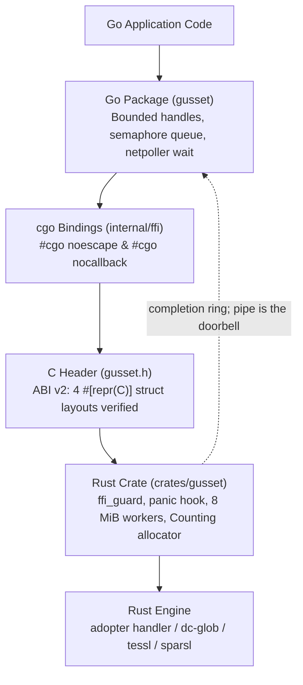
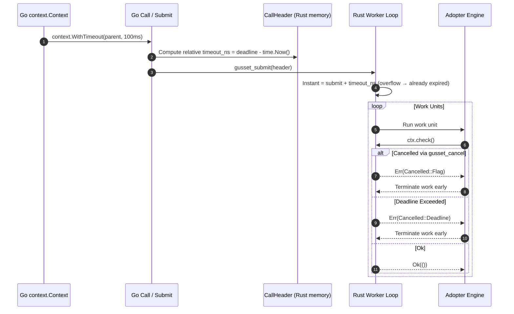
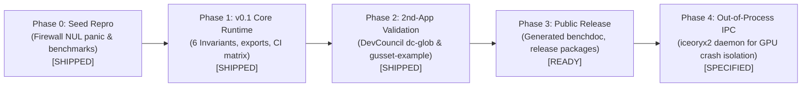

# Go–Rust Runtime Contract: Build Plan

As of 2026-09-20. Author: Bharath Chandra. Living copy: https://claude.ai/code/artifact/e46eb30a-a291-448c-9cdb-1b205044239e

## Thesis and scope

Build the runtime contract for running a Rust engine inside a Go service: the layer between "bindings exist" and "this runs in production without taking the Go process down" (detailed in [`docs/why.md`](why.md)). It is infrastructure for Bharath's own Rust+Go apps first; the open-source framework is the extraction, not the goal.

In scope:

- Panic firewall with a correct status/error protocol and free path
- Bounded in-flight calls, deadlines enforced inside Rust, poisoned handles after a caught panic
- Rust-owned worker threads; completions published into a Rust-owned ring the reader polls, with a pipe the netpoller watches when that reader parks, never a blocked OS thread
- ABI version and struct-size verification at Go `init()`
- Rust allocator stats fed into Go's memory limit
- Trace/timeout header on every call (`trace_id`, `span_id`, relative `timeout_ns`); per-job cancel flag in Rust memory
- A CI matrix that proves all of the above on every commit

Out of scope, on purpose:

- Type marshalling and binding generation: sit on top of `cbindgen`, hand-written cgo, or uniffi-bindgen-go
- cgo-free calling paths (`purego`, `asmcgocall` trampolines): every Go minor release can break them
- Rust-driving-Go async (rust2go already owns that, at the cost of `cgocheck=0`)
- Zero-copy IPC transport: defer to iceoryx2, whose Go binding is planned but unbuilt (Phase 4)

## Architecture

Two small packages and a hand-maintained C header verified by type-level CI diffs; the binding layer underneath is whatever the app already uses.

The Go package never parks an OS thread on Rust work: a call submits to the Rust worker pool and returns a completion the Go side waits on through a channel.

| Component | Language | Responsibilities | Public surface (v0.1) |
| --- | --- | --- | --- |
| Runtime crate | Rust | `ffi_guard`, `FfiStatus` (ptr+len, never NUL-terminated), `gusset_status_free`, panic hook with location, ABI layout export, named field offsets, worker pool with explicit 8 MiB stack size, allocator stats, timeout and cancel checks | 17 exported functions, 4 `#[repr(C)]` types (`CallHeader`, `FfiStatus`, `AbiLayout`, `AllocStats`) |
| Runtime package | Go | `Handle` with semaphore, timeout, poison state; `init()` ABI check including named field offsets; completion ring polled by the dispatch goroutine, with an `os.Pipe` whose write end Rust owns for wake tokens and overflow; `noescape` and `nocallback` on every export; allocator stats bridged to `debug.SetMemoryLimit` | `Open`, `Close`, `Call`, `CallBuffer`, `Submit`, `Wait` (and `WaitBuffer`), `NewBuffer` (with `Buffer.Free`), `Shutdown`, `Stats`, `AdviseMemoryLimit`, `Threads`, `DrainLogs` (12 public entry points; `WaitBuffer`, `CallBuffer`, and `Shutdown` logged in `DECISIONS.md`) |
| Header | C | Hand-maintained `internal/ffi/gusset.h`; verified by `tests/header_match.rs` parameter and return types against Rust exports | one `.h` file |
| Example engine | Rust + Go | Reference engine that exercises every failure mode: panic, NUL in message, deadline miss, large allocation, deep recursion | reference for adopters (`crates/gusset-example`) |

Invariants the packages enforce:

1. (I1) Memory is freed by the allocator that created it, through an exported `free_*`; never `C.free` on Rust memory.
2. (I2) No Rust panic crosses the boundary; a caught panic poisons the handle and every later call returns `FFI_POISONED`.
3. (I3) A call cannot outlive its deadline by more than one work unit; Rust checks the timeout and the job's cancel flag between units.
4. (I4) In-flight calls per handle never exceed the pool size; excess callers wait on a Go semaphore, not an OS thread.
5. (I5) Heavy Rust work runs on Rust-spawned threads with explicit stack size, never on the caller's g0 stack (musl default is 128 KB).
6. (I6) Go `init()` refuses to start on an ABI version, struct-size, or named-field offset mismatch.

### Cooperative Cancellation & Relative Deadline Flow (I3, R9)

Cross-boundary cancellation uses relative monotonic timeouts and per-job `AtomicBool` flags in Rust memory. Rust never reads Go memory, and monotonic clock sources are never mixed:

## Phases

Five phases; each has an exit criterion that is a test, not an opinion. Durations assume solo, part-time work.

| Phase | What ships | Exit criterion | Rough effort |
| --- | --- | --- | --- |
| 0 · Seed | Repo from the existing benchmark and firewall repro; CI running `go test -bench` and the NUL-panic test on Linux and macOS | The document's original `ffi_guard` fails CI with SIGABRT; the hardened one passes | 1 weekend |
| 1 · v0.1 for the first app | Rust crate + Go package with the six invariants; hand-maintained header; bounded handle; completion channel; ABI check | The Go service in front of tessl/sparsl runs on it; thread-cap soak (10k blocked calls) fails to crash the process | 3–5 weeks |
| 2 · Second-app validation | Adopt in a second Rust+Go app with a different shape (CPU-bound, no GPU) without changing the public surface | Zero API changes needed, or the changes are made and both apps still pass the matrix | 2–3 weeks |
| 3 · Public release | README with the measured numbers, the example engine, uniffi-bindgen-go interop example, `v0.x` tags, crate + Go module published | First external issue that is a real bug report, not a question | 1–2 weeks |
| 4 · Out-of-process module | Go binding for iceoryx2 (contributed upstream) as a separate module for the GPU-engine case where in-process crash isolation is impossible | tessl behind the daemon survives an induced Metal fault with the Go service still serving | 4–8 weeks, only if Phase 1 shows the need |

Phase 1 build order is in `AGENTS.md` (Repo layout and build order).

## Verification matrix

The CI matrix is the product: adopters get it for free, and it is what no binding generator offers. The full job table is in `AGENTS.md` (Testing plan).

Baseline numbers from the seed benchmark (Go 1.24.7, Rust 1.95, x86-64 Linux): 64 ns per cgo call, 0.67 ns per item at 256-item batches, 0 allocations with `noescape`, 56 ns per channel send. The README reports these per platform on every release.

## Success and kill criteria

Success is internal first: the second Rust+Go app adopts the packages with no public-surface changes. That is the signal to publish.

Success (Phase 2 exit):

- Both apps run the full matrix green on Linux and macOS
- Boundary code in each app is under 200 lines outside the packages
- The tessl/sparsl service shows no thread growth under the soak test and no OOM under a memory-limit test

Kill or narrow if:

- Phase 1 exceeds 8 weeks of part-time work: cut to crate-only (guard, status, ABI check) and ship that
- The second app needs a different concurrency model that cannot be expressed as bounded submit + completion: the abstraction is wrong, keep it app-internal
- A Go release breaks the pipe completion path: fall back to a blocking call under the semaphore, which is still correct, only slower

## Name

Gusset: the plate that reinforces the joint between two structural members; the framework is the plate, not the members. Free on crates.io as of 2026-09-20. Runners-up that were also free: Keelson, Ferrogo. Taken: Gasket, Airlock, Bulkhead, Dovetail, Tenon, Mortise, Sluice, Ferrule, Cleat, Caisson, Isthmus.

Naming convention: crate `gusset`, Go module `github.com/bharathvbcr/gusset`, out-of-process adapter `gusset-ipc`, example engine `gusset-example`.

## Risks

| Risk | Likelihood | Mitigation |
| --- | --- | --- |
| Scope creep into type marshalling or cgo-free calling | High | The out-of-scope list is in the README; PRs that add marshalling are declined with a pointer to uniffi-bindgen-go |
| Go runtime changes break the completion path or `noescape` semantics | Medium | CI runs against Go tip weekly; blocking fallback under the semaphore stays supported |
| Rust `panic=abort` in a dependency's profile silently disables the firewall | Medium | Build script asserts `panic=unwind`; the panic zoo test fails otherwise |
| Two Rust staticlibs in one Go binary (duplicate `std` symbols) | Medium for adopters | Document the umbrella-crate rule; example repo shows it |
| Solo maintenance stalls after Phase 3 | Medium | Keep the surface small (17 exports); the matrix does the reviewing |
| iceoryx2 ships its own Go binding before Phase 4 | Low–medium | Good outcome: adopt it and drop Phase 4 |

Open decisions from the first draft are all resolved in `DECISIONS.md`.
