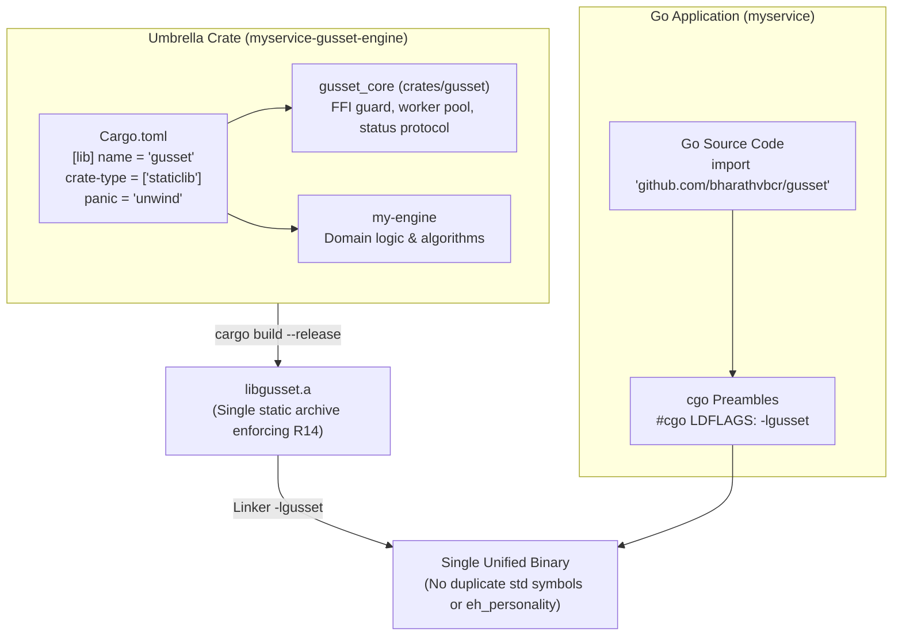
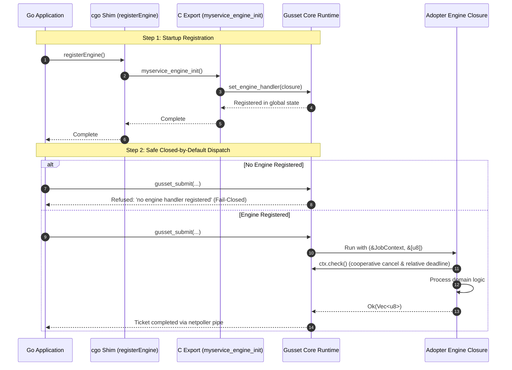
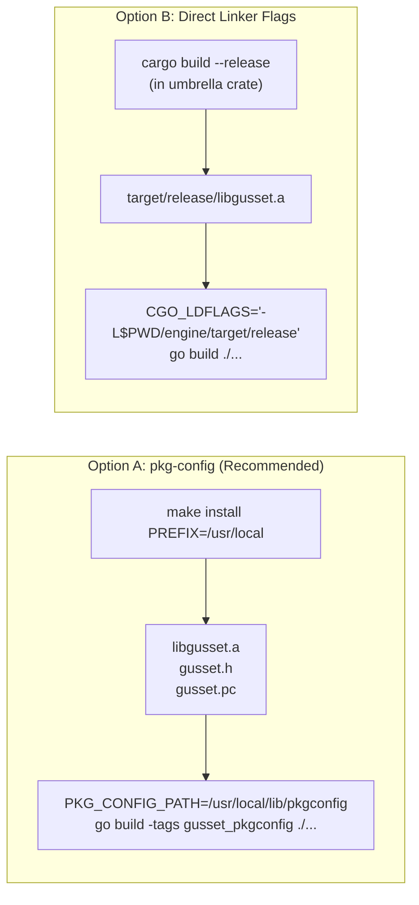

# Adopting Gusset

Everything here was derived by adopting Gusset in a real Go service that drives a
real third-party Rust crate, not by writing down what ought to work. The worked
example is DevCouncil's `go_orchestrator` and its `dc-glob` crate; the numbers at
the bottom are from that run.

Each step exists because skipping it produces a specific failure, named inline.

---

## 1. Build one staticlib, from an umbrella crate

R14 allows exactly one Rust `staticlib` per Go binary. Two of them put std in the
binary twice and the link fails with `rust_eh_personality` defined twice.

So an adopter does not link Gusset's archive *and* their engine's archive. They
build a single umbrella crate that depends on both.



**The part that is easy to get wrong:** cgo links `-lgusset`, so the umbrella's
output file must be `libgusset.a` no matter what the package is called. That is
`[lib] name`, not `[package] name`:

```toml
[package]
name = "myservice-gusset-engine"   # any name you like
version = "0.1.0"
edition = "2021"

[lib]
name = "gusset"                    # <- the output must be libgusset.a
crate-type = ["staticlib"]

[dependencies]
# Renamed, because this crate cannot also be called `gusset`.
gusset_core = { package = "gusset", version = "0.0.1" }
my-engine  = { path = "../my-engine" }

[profile.release]
codegen-units = 1
panic = "unwind"                   # R2: catch_unwind cannot catch an abort
```

`panic = "unwind"` is required — `build.rs` fails the build under `abort`, because
the panic firewall silently becomes a no-op. LTO is **your** choice: `lto = "thin"`
and `lto = "fat"` are both fine, and no Gusset invariant depends on either. Note
that a `fat`-LTO archive holds LLVM bitcode, which a system `nm` from an older LLVM
cannot read; use the toolchain's `llvm-nm` if you inspect symbols.

## 2. Register your engine, and call the registration

Gusset exports exactly 14 C symbols and **none of them registers an engine**.
Registration is a Rust API, so the umbrella crate has to export its own entry point
for Go to call:

```rust
use gusset_core::{set_engine_handler, JobContext};

/// # Safety
/// Call once, before the first submission. Safe to call across FFI.
#[no_mangle]
pub extern "C" fn myservice_engine_init() {
    set_engine_handler(|ctx: &JobContext, input: &[u8]| -> Result<Vec<u8>, String> {
        // Cooperative cancellation between work units (I3, R9).
        ctx.check().map_err(|e| format!("cancelled: {:?}", e))?;

        // Validate at the boundary. Return Err for bad input; never panic and
        // never `from_utf8_unchecked`.
        let text = std::str::from_utf8(input)
            .map_err(|e| format!("input is not valid UTF-8: {}", e))?;

        Ok(my_engine::run(text).into_bytes())
    });
}
```

and a small cgo shim on the Go side:

```go
package main

/*
#cgo noescape myservice_engine_init
#cgo nocallback myservice_engine_init
void myservice_engine_init(void);
*/
import "C"

func registerEngine() { C.myservice_engine_init() }
```

Call `registerEngine()` before the first `Call`, `Submit`, or `NewBuffer`.

**If you forget, every submission is refused** with

```
gusset: no engine handler registered; call gusset::set_engine_handler() before
submitting work (submission refused rather than run against a built-in engine)
```

That refusal is deliberate. Gusset ships a built-in diagnostic engine that selects
its behaviour from the first input byte — byte 1 is `panic!`, byte 2 panics with an
embedded NUL, byte 3 panics with a non-string payload. It used to run by default
whenever no engine was registered, which meant the first byte of an untrusted
payload could choose a Rust panic and poison the handle. It is now reachable only
through `gusset.WithDiagnosticEngine()`, which is for Gusset's own test suites.
Production code must never pass it.



## 3. Link the archive

The default `#cgo LDFLAGS` point into `target/release` **inside a Gusset source
checkout**. That directory is gitignored, so it is not in the published module and
does not exist in the module cache. Building against the module with no further
configuration gives you:

```
ld: warning: search path '.../internal/ffi/../../target/release' not found
ld: library 'gusset' not found
```



Pick one of the two supported ways out.

### Option A — pkg-config (recommended for installed libraries)

```bash
make install PREFIX=/usr/local          # writes libgusset.a, gusset.h, gusset.pc
PKG_CONFIG_PATH=/usr/local/lib/pkgconfig go build -tags gusset_pkgconfig ./...
```

### Option B — point the linker at the archive

Best when your umbrella crate's `target/release` is a build output of your own
repository:

```bash
cargo build --release --manifest-path ./engine/Cargo.toml
CGO_LDFLAGS="-L$PWD/engine/target/release" go build ./...
```

Both were verified end to end against the module-cache layout, not just in a source
checkout.

## 4. Use the handle

```go
h, err := gusset.Open(gusset.WithPoolSize(4))   // <= gusset.MaxPoolSize
defer h.Close()

ctx, cancel := context.WithTimeout(ctx, 100*time.Millisecond)
defer cancel()

out, err := h.Call(ctx, payload)
```

Things worth knowing before you hit them:

- **Pool size is bounded** at `gusset.MaxPoolSize` (1024). Each worker is an OS
  thread with an 8 MiB stack, so the request is refused rather than clamped: a
  caller who asked for 10,000 workers and silently got 1024 keeps the wrong
  capacity model.
- **A caught panic poisons the handle**, permanently. Every later call returns
  `ErrPoisoned`. `Close` and reopen is the only way out; that is the bulkhead, not
  a bug.
- **Cancellation is cooperative.** A deadline is enforced *between* work units, so
  your engine must call `ctx.check()` inside long loops. An engine that never
  checks cannot be cancelled, and `gusset_shutdown` will report it as still in
  flight when the drain budget expires.
- **A ticket has exactly one waiter.** `Wait` on an unknown ticket returns
  `ErrUnknownTicket`; a second concurrent `Wait` on the same ticket returns
  `ErrTicketBusy`. Both used to park the caller forever, ignoring its context.
- **`Buffer.Bytes()` returns Rust memory.** The Go garbage collector does not trace
  it, and holding the slice does not keep the `Buffer` alive. Keep the `*Buffer`
  reachable for as long as you use its bytes, and do not use a slice after `Free`
  or `Handle.Close`.
- **Trace propagation is explicit.** Attach a value implementing
  `TraceID() [16]byte` / `SpanID() [8]byte` under `gusset.SpanContextKey`.

---

## What the DevCouncil run measured

DevCouncil's `go_orchestrator` reaches its Rust kernel by spawning a subprocess per
call; its own `proc.go` documents the cost, including that a `Start` blocked in the
kernel falls outside both the context bound and `Cmd.WaitDelay`.

Adopting Gusset for `dc-glob` (`pub fn matches(pattern, name) -> bool`), on
darwin/arm64, Go 1.27.1, Rust 1.98.0:

| Check | Result |
| :--- | :--- |
| 13 glob cases through the FFI boundary | identical to Python `fnmatch.fnmatchcase`, 0 mismatches |
| 4 malformed payloads (short, truncated, over-long length, invalid UTF-8) | all returned as engine errors, none panicked, handle not poisoned |
| 12,800 calls from 64 concurrent goroutines, pool size 4 | 0 failures. Cold start 224 ms (~57k calls/sec); steady state 64–74 ms across four runs (~173k–199k calls/sec) |
| OS threads during that load | 8–10, against 64 concurrent callers (I4: callers park on the Go semaphore) |
| Expired context | refused before reaching the engine |

The thread count is the invariant worth watching: 64 concurrent Go callers produced
8–10 OS threads, because callers queue on Gusset's semaphore rather than each
pinning an M inside a cgo call.

These are throughput numbers for this workload on this machine, not a benchmark
result under R15 — `dc-glob` is microseconds of work, so the figure is dominated by
boundary overhead, which is exactly what makes it a useful check on the boundary and
a poor proxy for a real engine. The point of comparison is not the absolute rate but
that the same work previously cost one process spawn per call.
