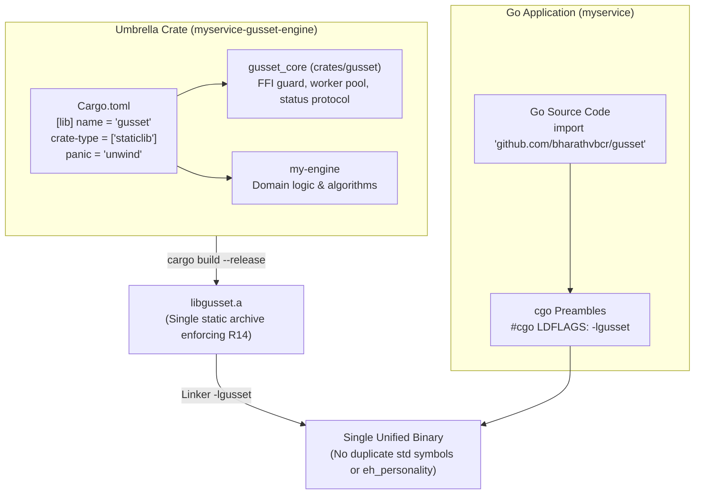
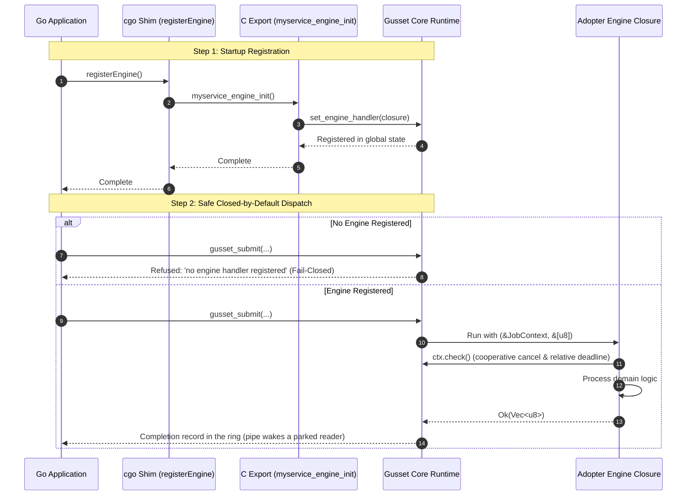
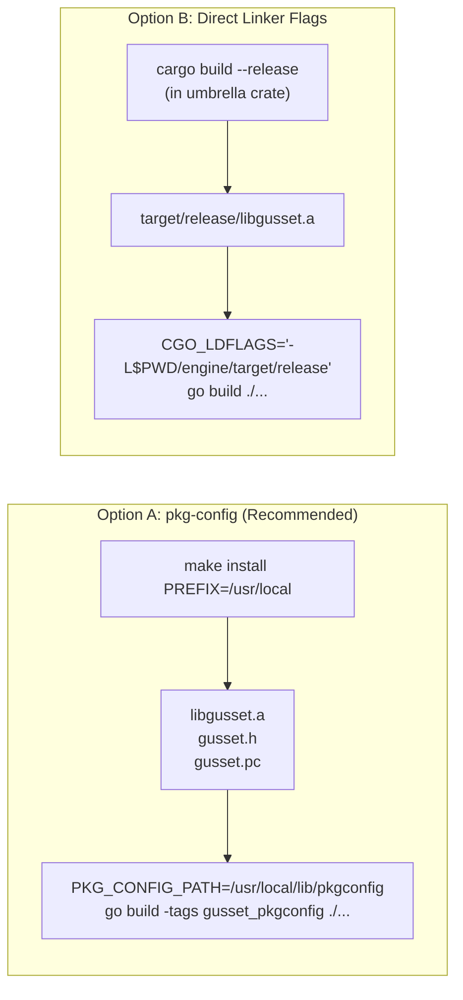

# Adopting Gusset

Everything here was derived by adopting Gusset in a real Go service that drives a
real third-party Rust crate, not by writing down what ought to work. The worked
example is DevCouncil's `go_orchestrator` and its `dc-glob` crate; the numbers at
the bottom are from that run.

Each step exists because skipping it produces a specific failure, named inline.

---

## 1. Build one staticlib, from an umbrella crate

R14 allows exactly one Rust `staticlib` per Go binary. Two of them put std in the
binary twice and the link fails with `rust_eh_personality` defined twice.

So an adopter does not link Gusset's archive *and* their engine's archive. They
build a single umbrella crate that depends on both.



**The part that is easy to get wrong:** cgo links `-lgusset`, so the umbrella's
output file must be `libgusset.a` no matter what the package is called. That is
`[lib] name`, not `[package] name`:

```toml
[package]
name = "myservice-gusset-engine"   # any name you like
version = "0.1.0"
edition = "2021"

[lib]
name = "gusset"                    # <- the output must be libgusset.a
crate-type = ["staticlib"]

[dependencies]
# Renamed, because this crate cannot also be called `gusset`.
gusset_core = { package = "gusset", version = "0.0.2" }
my-engine  = { path = "../my-engine" }

[profile.release]
codegen-units = 1
panic = "unwind"                   # R2: catch_unwind cannot catch an abort
```

`panic = "unwind"` is required — `build.rs` fails the build under `abort`, because
the panic firewall silently becomes a no-op. LTO is **your** choice: `lto = "thin"`
and `lto = "fat"` are both fine, and no Gusset invariant depends on either. Note
that a `fat`-LTO archive holds LLVM bitcode, which a system `nm` from an older LLVM
cannot read; use the toolchain's `llvm-nm` if you inspect symbols.

## 2. Register your engine, and call the registration

Gusset exports exactly 17 C symbols and **none of them registers an engine**.
Registration is a Rust API, so the umbrella crate has to export its own entry point
for Go to call:

```rust
use gusset_core::{set_engine_handler, JobContext};

/// # Safety
/// Call once, before the first submission. Safe to call across FFI.
#[no_mangle]
pub extern "C" fn myservice_engine_init() {
    set_engine_handler(|ctx: &JobContext, input: &[u8]| -> Result<Vec<u8>, String> {
        // Cooperative cancellation between work units (I3, R9).
        ctx.check().map_err(|e| format!("cancelled: {:?}", e))?;

        // Validate at the boundary. Return Err for bad input; never panic and
        // never `from_utf8_unchecked`.
        let text = std::str::from_utf8(input)
            .map_err(|e| format!("input is not valid UTF-8: {}", e))?;

        Ok(my_engine::run(text).into_bytes())
    });
}
```

and a small cgo shim on the Go side:

```go
package main

/*
#cgo noescape myservice_engine_init
#cgo nocallback myservice_engine_init
void myservice_engine_init(void);
*/
import "C"

func registerEngine() { C.myservice_engine_init() }
```

Call `registerEngine()` before the first `Call`, `Submit`, or `NewBuffer`.

**If you forget, every submission is refused** with

```
gusset: no engine handler registered; call gusset::set_engine_handler() before
submitting work (submission refused rather than run against a built-in engine)
```

That refusal is deliberate. Gusset ships a built-in diagnostic engine that selects
its behaviour from the first input byte — byte 1 is `panic!`, byte 2 panics with an
embedded NUL, byte 3 panics with a non-string payload. It used to run by default
whenever no engine was registered, which meant the first byte of an untrusted
payload could choose a Rust panic and poison the handle. It is now reachable only
through `gusset.WithDiagnosticEngine()`, which is for Gusset's own test suites.
Production code must never pass it.



## 3. Link the archive

The default `#cgo LDFLAGS` point into `target/release` **inside a Gusset source
checkout**. That directory is gitignored, so it is not in the published module and
does not exist in the module cache. Building against the module with no further
configuration gives you:

```
ld: warning: search path '.../internal/ffi/../../target/release' not found
ld: library 'gusset' not found
```



Pick one of the two supported ways out.

### Option A — pkg-config (recommended for installed libraries)

```bash
make install PREFIX=/usr/local          # writes libgusset.a, gusset.h, gusset.pc
PKG_CONFIG_PATH=/usr/local/lib/pkgconfig go build -tags gusset_pkgconfig ./...
```

### Option B — point the linker at the archive

Best when your umbrella crate's `target/release` is a build output of your own
repository:

```bash
cargo build --release --manifest-path ./engine/Cargo.toml
CGO_LDFLAGS="-L$PWD/engine/target/release" go build ./...
```

Both were verified end to end against the module-cache layout, not just in a source
checkout.

## 4. Use the handle

```go
h, err := gusset.Open(gusset.WithPoolSize(4))   // <= gusset.MaxPoolSize
defer h.Close()

ctx, cancel := context.WithTimeout(ctx, 100*time.Millisecond)
defer cancel()

out, err := h.Call(ctx, payload)
```

Things worth knowing before you hit them:

- **Completions travel through a shared-memory ring.** `Open` calls
  `gusset_handle_ring`. Workers publish each record into a 128-byte slot and
  the reader polls it with atomic loads. The pipe wakes a reader that has
  parked (one 8-byte token of zeros) and carries a record only when the ring
  is full. A success of at most 48 bytes is inside that record, so a small
  `Call` does not call `gusset_take`. A C host that never attaches the ring
  keeps the pipe protocol. The ring stays valid until `gusset_ring_release`,
  which the Go reader calls after `Close`.
- **Pool size is bounded** at `gusset.MaxPoolSize` (1024). Each worker is an OS
  thread with an 8 MiB stack, so the request is refused rather than clamped: a
  caller who asked for 10,000 workers and silently got 1024 keeps the wrong
  capacity model.
- **A caught panic poisons the handle**, permanently. Every later call returns
  `ErrPoisoned`. `Close` and reopen is the only way out; that is the bulkhead, not
  a bug.
- **A deadline bounds the caller, not the work.** `Call` and `Wait` return
  `ctx.Err()` when your context expires, whatever the engine is doing. The pool
  permit stays with the still-running job until it actually stops, so a caller
  walking away never lets in-flight work exceed the pool size — which also means
  a pool whose jobs all outlive their deadlines is a pool with no free permits,
  and the next `Submit` will block until one comes back. That is backpressure
  working, not a stall.
- **Cancellation itself is cooperative**, and that is a separate thing. The flag
  is only read where your engine calls `ctx.check()`, so an engine that never
  checks runs to completion regardless — nothing is interrupted, the caller is
  simply no longer blocked on it. Call `ctx.check()` inside long loops if you
  want the work to stop early rather than merely be abandoned. Check once per
  chunk (for example `for chunk in data.chunks(4096) { ctx.check()?; … }`), not
  on every iteration: a branch in the hot loop stops LLVM from vectorizing it.
  Moving the check made the example engine's sum of squares about 4× faster
  (see [choosing](choosing.md)). Note that `gusset.Shutdown` will report an
  engine that never checks as still in flight when its drain budget expires.
- **Pick the vector width at run time for hot kernels.** A Rust library is
  built for the baseline target unless you say otherwise: on x86-64 that is
  SSE2, 128-bit vectors, while Go's `simd` package uses AVX2 or AVX-512 when
  the CPU has them. `-C target-cpu=native` fixes that only for the machine
  that built it. Compile the same loop several times under
  `#[target_feature]` and dispatch once per call instead:

  ```rust
  pub fn kernel(chunk: &[u8]) -> u32 {
      #[cfg(target_arch = "x86_64")]
      {
          if std::is_x86_feature_detected!("avx512bw") {
              // SAFETY: the CPU reports AVX-512BW.
              return unsafe { kernel_avx512(chunk) };
          }
          if std::is_x86_feature_detected!("avx2") {
              // SAFETY: the CPU reports AVX2.
              return unsafe { kernel_avx2(chunk) };
          }
      }
      kernel_portable(chunk)
  }

  #[inline(always)]
  fn kernel_portable(chunk: &[u8]) -> u32 {
      chunk.iter().map(|&b| (b as u32) * (b as u32)).sum()
  }

  #[cfg(target_arch = "x86_64")]
  #[target_feature(enable = "avx2")]
  fn kernel_avx2(chunk: &[u8]) -> u32 { kernel_portable(chunk) }

  #[cfg(target_arch = "x86_64")]
  #[target_feature(enable = "avx512f,avx512bw")]
  fn kernel_avx512(chunk: &[u8]) -> u32 { kernel_portable(chunk) }
  ```

  The detection is one cached load. On an AVX-512 host this took Gusset's
  diagnostic kernel from 148 µs to 46 µs per MiB, faster than a
  `target-cpu=native` build (57 µs); see `pool::sys::sum_squares_chunk`.
- **`Handle.Close` has no budget.** It cancels, then *joins* its worker threads,
  so its latency is whatever your engine still has left to do — detaching them
  would leave OS threads running against Rust memory `Close` is about to free.
  For a bounded shutdown, call `gusset.Shutdown(budget)` first and then `Close`:
  the cancel has already landed, so the join is short. `Shutdown` is process-wide
  and one-way.
- **A ticket has exactly one waiter.** `Wait` on an unknown ticket returns
  `ErrUnknownTicket`; a second concurrent `Wait` on the same ticket returns
  `ErrTicketBusy`. Both used to park the caller forever, ignoring its context.
- **`Buffer.Bytes()` returns Rust memory.** The Go garbage collector does not trace
  it, and holding the slice does not keep the `Buffer` alive. Keep the `*Buffer`
  reachable for as long as you use its bytes, and do not use a slice after `Free`
  or `Handle.Close`. A `*Buffer` keeps its `*Handle` reachable, so a
  handle cannot be collected, and closed, while one of its buffers is still in use.
- **Buffers are 64-byte aligned on every path.** That includes a small
  `WaitBuffer` result on a poisoned handle, which is carried in aligned Go memory
  (`ID() == 0`) rather than lost.
- **Trace propagation is explicit.** Attach a value implementing
  `TraceID() [16]byte` / `SpanID() [8]byte` under `gusset.SpanContextKey`.

## 5. Zero-copy output with the stable `Allocator` trait (Rust 1.100+)

When your umbrella crate builds with Rust 1.100 or newer, `gusset::BufferAlloc`
implements `std::alloc::Allocator`. Build a large output directly in buffer memory
and return it. Gusset hands that allocation to Go as the result buffer. There is
no copy on the worker and none on the cgo thread, and the memory is 64-byte
aligned:

```rust
use gusset::{BufferAlloc, JobOutput};

gusset::register_engine(7, |ctx, input| {
    let mut out: Vec<u8, BufferAlloc> = Vec::new_in(BufferAlloc);
    out.try_reserve(estimate(input)).map_err(|e| e.to_string())?; // fallible
    render_into(&mut out, input, ctx)?;
    Ok(JobOutput::from(out))
});
```

- **Grow fallibly.** Use `try_reserve`. If an infallible `push` or `extend`
  cannot allocate, it aborts the whole process, Go included, and no panic
  firewall can catch an abort. The 1 GiB buffer ceiling is checked when Gusset
  adopts the output, not inside the allocator, for the same reason.
- **Accounting stays exact.** `BufferAlloc` bytes are counted once in
  `gusset.Stats()`, whether or not you install `Counting` as the global
  allocator. `Counting<A>` also works as a per-collection allocator. Wrap
  `System` or an arena with it, not a proxy for `Global`:
  `Vec::new_in(Counting::new(System))`.
- **Spare capacity is kept, not reallocated away.** Go sees `len`, and
  `Stats()` counts `capacity`. Call `shrink_to_fit` yourself if the slack
  matters. Capacity above 1 GiB is not adopted: the bytes are copied out and
  the oversized allocation freed.
- **Older compilers are unaffected.** A build-time probe
  (`crates/gusset/allocator_probe.rs`) enables all of this per compiler, and
  `gusset::ALLOCATOR_API` reports the result. `GUSSET_ALLOCATOR_API=0` forces
  the fallback, and `=1` turns a failed probe into a build error that prints
  the compiler's output.
- **Gate your own code on gusset's answer, not your own probe.** `gusset`
  declares `links = "gusset"` and publishes the result to direct dependents,
  so your engine crate's `build.rs` is:

  ```rust
  fn main() {
      println!("cargo::rustc-check-cfg=cfg(gusset_allocator_api)");
      if std::env::var("DEP_GUSSET_ALLOCATOR_API").as_deref() == Ok("1") {
          println!("cargo::rustc-cfg=gusset_allocator_api");
      }
  }
  ```

  A probe of your own could disagree with the one gusset compiled with.
  `crates/gusset-example` uses exactly this, and its test asserts the two agree.
- **`JobOutput` is `#[non_exhaustive]`.** Its variants depend on the compiler,
  so an exhaustive `match` would compile on one toolchain and fail on the next.
  Add a `_ =>` arm.
- **Do not write to an input `Buffer` while its job runs.** The engine reads
  it as a Rust `&[u8]`; a concurrent Go write is a data race. Reading is fine.
- **Gusset's workers block SIGPIPE.** A completion write to a closed pipe
  returns EPIPE, and the handle then refuses new work, instead of the signal
  terminating your process. A C host should still close its read end only
  after `gusset_handle_close`.

---

## What the DevCouncil run measured

DevCouncil's `go_orchestrator` reaches its Rust kernel by spawning a subprocess per
call; its own `proc.go` documents the cost, including that a `Start` blocked in the
kernel falls outside both the context bound and `Cmd.WaitDelay`.

Adopting Gusset for `dc-glob` (`pub fn matches(pattern, name) -> bool`), on
darwin/arm64, Go 1.27.1, Rust 1.98.0:

| Check | Result |
| :--- | :--- |
| 13 glob cases through the FFI boundary | identical to Python `fnmatch.fnmatchcase`, 0 mismatches |
| 4 malformed payloads (short, truncated, over-long length, invalid UTF-8) | all returned as engine errors, none panicked, handle not poisoned |
| 12,800 calls from 64 concurrent goroutines, pool size 4 | 0 failures. Cold start 224 ms (~57k calls/sec); steady state 64–74 ms across four runs (~173k–199k calls/sec) |
| OS threads during that load | 8–10, against 64 concurrent callers (I4: callers park on the Go semaphore) |
| Expired context | refused before reaching the engine |

The thread count is the invariant worth watching: 64 concurrent Go callers produced
8–10 OS threads, because callers queue on Gusset's semaphore rather than each
pinning an M inside a cgo call.

These are throughput numbers for this workload on this machine, not a benchmark
result under R15 — `dc-glob` is microseconds of work, so the figure is dominated by
boundary overhead, which is exactly what makes it a useful check on the boundary and
a poor proxy for a real engine. The point of comparison is not the absolute rate but
that the same work previously cost one process spawn per call.
