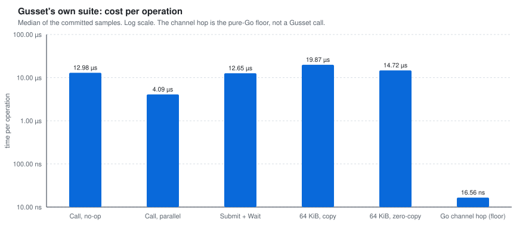
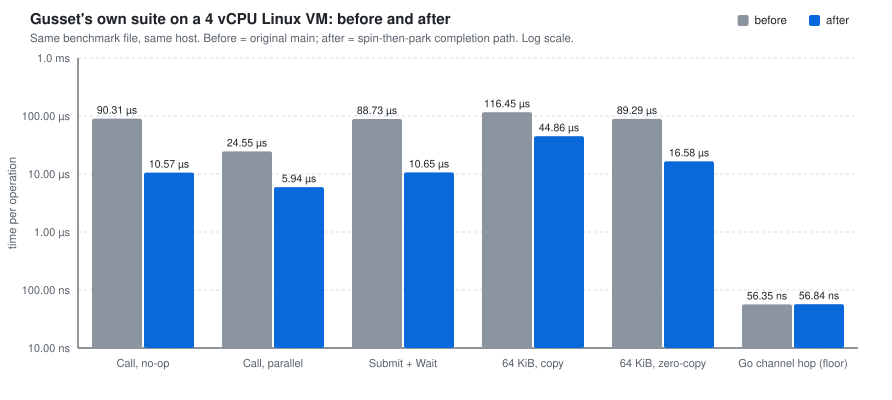
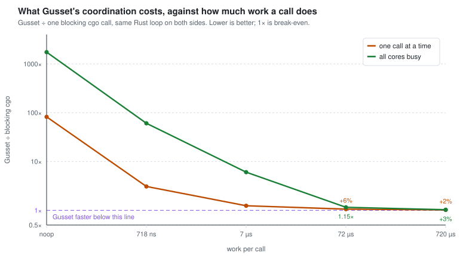
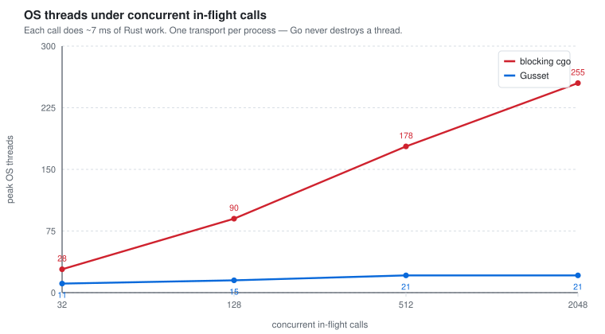
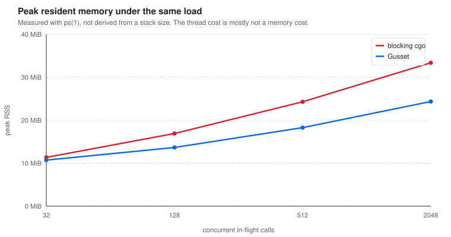
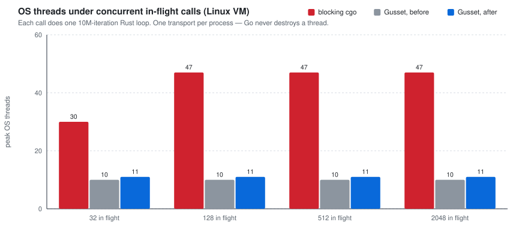
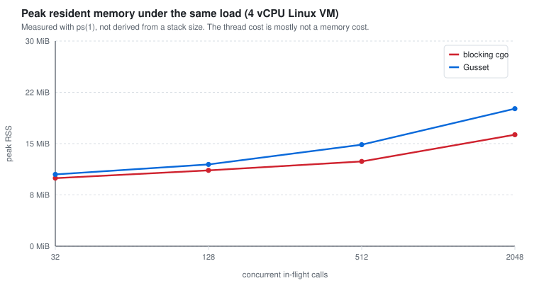
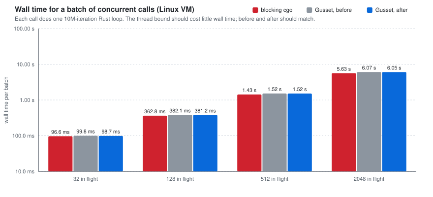
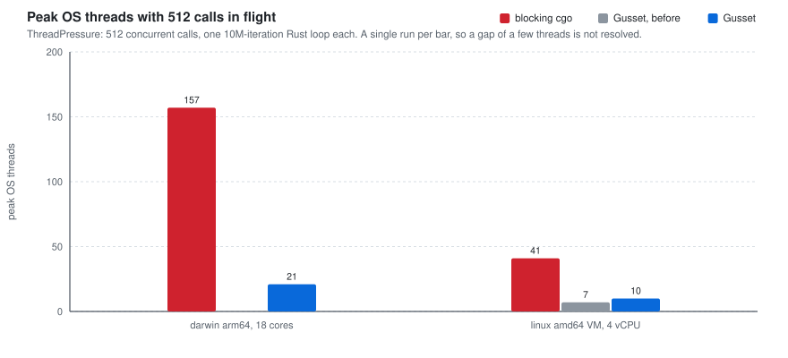

# Benchmarks, plotted

[Documentation Hub](README.md) · [Should You Adopt Gusset?](choosing.md) · [Adoption Guide](adoption.md)

Every chart here is drawn by [`tools/benchplot`](../tools/benchplot) from raw
`go test -bench` output committed under [`bench/results/`](../bench/results), and
`make docs-check` fails if a chart and its data disagree. The values are printed
on the charts, so this page carries none of its own.

A file is only charted if it carries the provenance header `bench/record.sh`
writes: a lock held across the run, one process per arm, CPU idle checked before
and after. `benchplot` refuses a file without one, and refuses a recording whose
arms disagree about how long the same Rust loop takes. This page lists what that
leaves out at the end.

Two hosts are recorded, and charts from different hosts are not comparable:

- **darwin/arm64** — Apple M5 Pro, 18 cores, Go 1.27.1, Rust 1.98.0.
- **linux/amd64 VM** — 4 vCPU Xeon, Go 1.27.1, Rust 1.98.1. Its "before" files
  are the original `main`; its "after" files are the spin-then-park completion
  path. Compare a before bar with its after bar, never a VM bar with a darwin one.

## Gusset's own suite

Six benchmarks from [`bench/bench_test.go`](../bench/bench_test.go): a no-op
`Call`, a parallel `Call`, `Submit` + `Wait`, a 64 KiB result by copy and by
zero-copy, and a pure-Go channel hop as the floor.

The same suite on the Linux VM, before and after the completion-path work. On a
virtualized host the cost of the old path was thread wake-ups, which is why the
serial rows moved the most.

## Against one blocking cgo call per request

The crossover sweep: the same Rust loop behind both transports, so the only
difference is transport. See [Should you adopt Gusset?](choosing.md) for how to
read it.

## Threads and memory under concurrency

The failure the library exists to prevent: blocking cgo's thread count tracks
concurrency, Gusset's tracks the pool.

The same sweep on the Linux VM. The thread bound is there too, and its cost in
wall time is the next chart.

Wall time for one batch, blocking cgo against Gusset before and after the
completion-path work. The two Gusset bars should match: that path changed
latency, not what the thread bound costs.

In that sweep the "before" Gusset run peaks one thread lower than "after", and
that difference is consistent across its six samples per level and does not move
with concurrency. The recordings do not say why, and this page does not guess.

`ThreadPressure` is the single-point version: 512 calls in flight at once, each
transport in its own process. Each bar is **one run**, because a thread count is
only attributable to the first transport sampled in a process, so these files are
recorded at `-count=1`. On the VM the "before" run peaks lower than the current
code. One run per bar cannot say whether that is a regression or noise, and
blocking cgo's count is several times either, so read the chart as "bounded
against unbounded", not as a ranking of the two Gusset builds. The scaling sweep
above, with six samples per level, is the better evidence for the before/after
comparison.

## Every benchmark in the tree

| Benchmark | Where it is defined | Chart |
| --- | --- | --- |
| `GussetCallNoop`, `GussetCallParallel`, `GussetSubmitWait`, `GussetBufferLarge`, `GussetBufferLargeZeroCopy`, `ChannelHop` | `bench/bench_test.go` | darwin suite, VM suite |
| `CrossoverSerial`, `CrossoverParallel` | `bench/seed/go/crossover_test.go` | crossover (darwin). **VM: refused, see below** |
| `ThreadScaling` | `bench/seed/go/crossover_test.go` | threads, memory (darwin); threads, memory, wall time (VM) |
| `ThreadPressure` | `bench/seed/go/crossover_test.go` | peak threads at 512 |
| `CgoRustNoop`, `CgoCNoop`, `CgoNoopParallel`, `Batch16/256/4096`, `ChannelHop`, `UnbufferedRoundTrip`, `PureGoLoopItem` | `bench/seed/go/ffi_test.go` | none: only an uncertified VM file exists |
| `SumSquares` (Go scalar, Go SIMD, Gusset) | `bench/simd_crossover_test.go` | none: only uncertified VM files exist |
| `CompletionTransport` (ring against pipe) | `transport_ab_test.go` | none: no committed results file |
| `CallNoopBare`, `CallNoopTraced` | `carrier_goexit_internal_test.go` | none: no committed results file |
| `Plain`, `NoEscape` | `bench/seed/esc/esc_test.go` | none: no committed results file |
| the r14 two-engine host | `bench/r14/` | none: no committed results file |

## What is not charted, and why

**Refused by a check.** `linux-amd64-vm/transport-after.txt` has a provenance
header, but its arms disagree by 11% about how long 100,000 iterations of the same
deterministic Rust loop take, against a 10% tolerance. That means the arms did
not run under the same machine conditions, so a ratio between them would describe
the load as much as the code. The tolerance is not loosened to draw the chart.
The VM crossover therefore has no chart, and the table of it in
[`bench/results/linux-amd64-vm/README.md`](../bench/results/linux-amd64-vm/README.md)
is hand-typed from the same file; treat it with the same suspicion until it is
re-recorded.

**No provenance header.** These were run by hand, so nothing certifies that the
machine was idle: `inline-*`, `ring-*`, `waitchan-*`, `seed-micro`, `simd` and
`simd-ring-multiversion`, all in `bench/results/linux-amd64-vm/`. They carry the
ring, inline-record and reused-channel rounds, the cgo floor and the SIMD
crossover.

**Never recorded.** `CompletionTransport`, `CallNoopBare`/`CallNoopTraced`, the
`esc` pair and the r14 host have no committed output at all.

To get any of these charted, re-record them through `bench/record.sh` on the host
that matters, commit the file, and add the chart to
[`tools/benchplot/gallery.go`](../tools/benchplot/gallery.go). The commands are
under "Reproduce" in the VM README.
