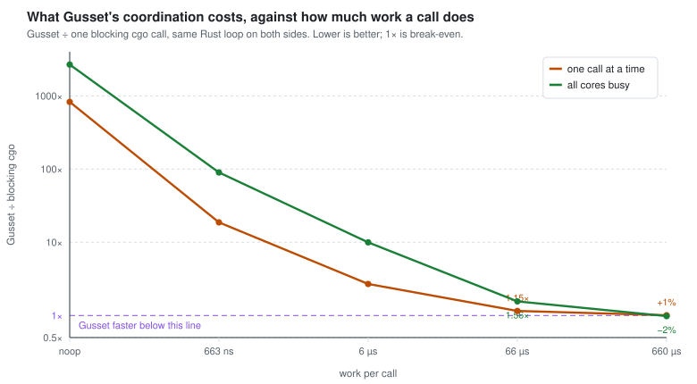
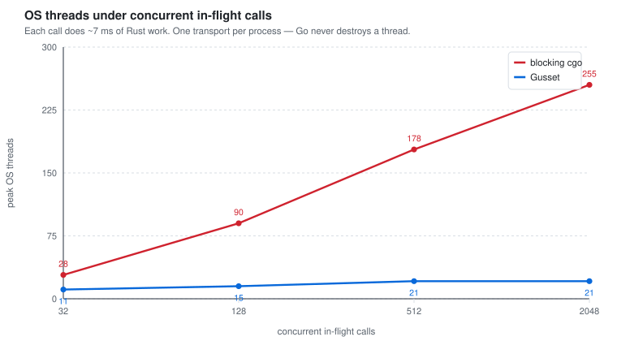
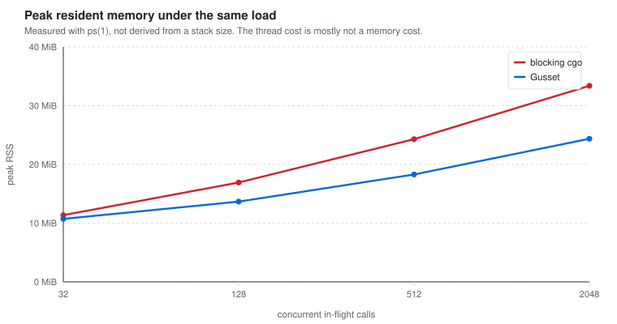

# Should you adopt Gusset?

Short answer: **only if your Rust calls are slow enough and concurrent enough**,
and only as a pinned dependency you are willing to read. This page gives you the
two numbers that decide it, what each adoption tier actually has to do
differently, and where Gusset is the wrong tool.

Every figure here is drawn from committed benchmark output by
[`tools/benchplot`](../tools/benchplot), the same way the README's table is drawn
by `tools/benchdoc`. `make docs-check` fails if a chart and its data disagree.
The numbers come from one machine — Apple M5 Pro, 18 cores, darwin/arm64, Go
1.27.1, Rust 1.98.0. Re-run `make bench-crossover && make bench-scaling` on
yours; the shapes should hold, the constants will not.

---

## Gusset does not save overhead. It caps it.

This is the thing to be clear about before anything else. **On one call, Gusset
cannot beat raw cgo, by construction.** It does everything the cgo call does and
then a semaphore, a submit, a worker hop, a pipe write and a netpoller wake on
top — a few microseconds a blocking `C.rs_do_work()` does not pay.

(At high concurrency the gap closes, because blocking cgo starts paying for its
own thread pressure. Measured at 2048 in-flight calls the two land close enough
that the ordering flips between recordings — cgo ahead by 1–3% on one, Gusset
ahead by 9% on the next — with blocking cgo's spread several times Gusset's.
Treat that as a tie with one noisy side, not as a win for either.)

What it changes is the *shape* of the cost. A blocking cgo call is cheap per
call and unbounded in aggregate: each in-flight call parks an OS thread, so your
thread count tracks your request concurrency. Gusset is a few microseconds per
call and flat in aggregate: concurrency queues on a Go channel and the thread
count tracks the pool you configured.

So the question is never "is Gusset faster". It is **"is my per-call overhead
small enough relative to my work, and is my concurrency high enough to care
about the threads".**

---

## The two numbers that decide it

### 1. How long does one call into Rust take?



Both transports run a byte-identical Rust loop (`rs_spin` in
`bench/seed/rs`, and diagnostic mode 11 in `gusset::pool`), so the gap between
them is transport and nothing else.

The curve is the whole argument. At a noop the ratio is three orders of
magnitude, and that is the honest worst case — it is also a workload nobody has.
By the time a call does a few hundred microseconds of real work the coordination
has disappeared into the noise.

| work per call | what Gusset costs you |
| --- | --- |
| under ~10 µs | **don't**. The overhead is the workload. Write it in Go, or call it with raw cgo. |
| ~70 µs | noticeable — low tens of percent serial, more under load |
| ~700 µs | a few percent |
| milliseconds and up | unmeasurable against the work |

If you are embedding Rust for a tokenizer, a regex scan, a proof verifier, an
image or audio transform, a search-index probe or a large parse, you are almost
certainly in the "few percent" band. If you are embedding it to add two numbers,
you are in the "don't" band and no amount of tuning fixes that.

### 2. How many calls are in flight at once?



This is the failure Gusset exists to prevent, and it only appears above
`GOMAXPROCS`. Below that the Go runtime already has the threads it needs and
blocking cgo looks free — which is exactly why a benchmark using
`testing.B.RunParallel` will tell you cgo is fine. It runs `GOMAXPROCS`
goroutines.

A server does not work that way. With hundreds of in-flight requests each
holding a thread inside Rust, Go's `sysmon` hands the P to a fresh M, that
goroutine enters cgo too, and the count climbs. Go's hard ceiling is 10,000
threads; past it the process dies with `runtime: program exceeds 10000-thread
limit`.

The effect is a function of *how long each call blocks*, not just how many there
are. `sysmon` only retakes a P after ~20 µs and wakes on a 20 µs–10 ms tick, so
short calls return before it looks. Millisecond-scale calls retake every time.
The chart above uses ~7 ms calls.

## The measured numbers

Everything in this section is generated from the committed recordings by
`tools/benchplot`, the same medians the charts above are drawn from. Do not edit
it by hand — `make docs-check` fails when it drifts from the data, which is
exactly how the previous, hand-typed version of this table came to quote thread
counts three recordings out of date.

<!-- BENCHPLOT:BEGIN -->
<!-- Generated by `make docs` (tools/benchplot). Do not edit by hand. -->

**Cost per call, by how much work the call does.** Both transports run a byte-identical Rust loop, so the difference is transport alone.

| work per call | cgo, serial | Gusset, serial | ratio | cgo, 18 goroutines | Gusset, 18 goroutines | ratio |
| --- | ---: | ---: | ---: | ---: | ---: | ---: |
| noop | 15.88 ns | 13.14 µs | 828× | 1.59 ns | 4.25 µs | 2678× |
| 663 ns | 706.10 ns | 13.21 µs | 18.7× | 47.01 ns | 4.23 µs | 90.0× |
| 6 µs | 7.19 µs | 19.42 µs | 2.70× | 471.05 ns | 4.70 µs | 9.97× |
| 66 µs | 73.37 µs | 84.70 µs | 1.15× | 4.70 µs | 7.34 µs | 1.56× |
| 660 µs | 709.31 µs | 715.64 µs | 1.01× | 47.34 µs | 46.39 µs | 0.98× |

**Cost of concurrency.** Medians over the committed sweep, each transport in its own process.

| in-flight calls | peak threads, cgo | peak threads, Gusset | peak RSS, cgo | peak RSS, Gusset | wall clock, cgo | wall clock, Gusset |
| ---: | ---: | ---: | ---: | ---: | ---: | ---: |
| 32 | 28 | 11 | 11.4 MiB | 10.7 MiB | 15.6 ms | 15.4 ms |
| 128 | 90 | 15 | 16.9 MiB | 13.7 MiB | 58.1 ms | 59.2 ms |
| 512 | 178 | 21 | 24.3 MiB | 18.3 MiB | 220.3 ms | 234.1 ms |
| 2048 | 255 | 21 | 33.4 MiB | 24.4 MiB | 874.5 ms | 962.2 ms |

Across that sweep (32 → 2048 in-flight calls) reserved *virtual* address space grew by **14.2 GiB** for blocking cgo and **643 MiB** for Gusset, over 226 and 10 extra OS threads — **64 MiB and 64 MiB per thread** respectively.
<!-- BENCHPLOT:END -->

Two things to read off the concurrency table. Blocking cgo's thread count tracks
concurrency; Gusset's tracks its pool, which is why 2048 callers cost it ~21
threads rather than ~370.

The wall-clock columns are the ones to be careful with. Across the recordings
taken while writing this page the two transports landed within about ten percent
of each other at every concurrency level, and **which one was ahead changed from
recording to recording** — sometimes at the same concurrency, on the same
machine, minutes apart. Run `benchstat` over the committed files yourself and
read the ± column before the median: at low concurrency the intervals are wide
enough to swallow the difference entirely.

So do not take a throughput ratio from this table, in either direction. The
honest summary is that the two are the same speed to within the noise of the
measurement, and the reason to choose between them is the thread column, which
is not noisy at all: one tracks your concurrency and the other tracks your pool.

Thread high-water marks and RSS also move between recordings, so read the shape
rather than the digits there too.

### And the one that is less impressive than you'd expect



Thread explosion is usually sold as a memory problem. Measured, it mostly is
not. Read the resident column of the table above: across the whole sweep the two
transports separate by roughly ten to fifteen megabytes, not the gigabytes the
thread count invites you to assume.

Reserved *virtual* address space is a different quantity and it does move. The
generated line above gives the growth for each transport and the per-thread
figure it works out to — and the thing to notice is that **both transports land
on the same per-thread number**, which is what makes this recording worth
quoting where earlier ones were not. An isolated VSZ delta can be anything;
two independent arms agreeing on the division is a measurement.

What that number is *not* is 8 MiB. The usual back-of-envelope — "every thread
reserves an 8 MiB stack, so a few hundred threads reserve a couple of gigabytes"
— predicts roughly an eighth of what this machine actually reserves per thread.
Darwin's VSZ carries mappings the arithmetic does not know about, so use the
measured figure for this platform and re-measure on yours rather than
multiplying by 8 MiB.

None of it is RAM. Address space matters under `vm.overcommit_memory=2`, in some
cgroup and VM accounting, and on 32-bit, and nowhere else. The RSS column is
what your container's memory limit actually sees.

The real cost of a few hundred threads is scheduler pressure, thread-creation
latency spikes on the request path, and the 10,000-thread cliff. Budget for
those, not for the RAM.

---

## The decision, in one rule

> Use Gusset when per-call Rust work is **≥ ~100 µs** *and* in-flight concurrency
> can exceed `GOMAXPROCS`. Otherwise use raw cgo and keep the simplicity.

100 µs is not a cliff — it is where the trade stops being obviously bad. Gusset's
fixed cost is the noop row of the table above: low tens of microseconds serial,
a few microseconds under parallel load, and it moves by a few microseconds
between recordings. At 100 µs of work you are paying low double-digit percent of
*the Rust call*, which is usually a low single-digit percent of the request
around it. Decide against your request budget, not against the call. Below
~10 µs there is no budget in which this works out.

Everything below is refinement of that rule.

---

## What switching actually saves

Not compute, and not memory. Be blunt about this, because most write-ups of
bounded-thread-pool designs are not.

At 2048 in-flight calls the two transports finish the same work within a few
percent of each other, and which one is ahead depends on the recording. Same
cores, no reliable throughput difference, so **the same number of instances**.
Peak RSS differs by a little over ten megabytes. There is no line in a cloud
bill that moves because you adopted Gusset. If someone shows you a business case
built on RAM savings, check which quantity they measured: a per-thread stack
figure estimates *reserved address space*, and address space is not memory. The
resident figure is the one your container limit enforces, and it moves by tens
of megabytes.

What you are buying is the failure mode. And the sharp edge is not the thread
count — it is this:

> **A goroutine inside a blocking cgo call cannot be cancelled.** Not by
> `context`, not by a deadline, not by `Close`. Go has no mechanism to interrupt
> it. It returns when Rust returns, and until then it holds a goroutine, an OS
> thread, and whatever request is waiting on it.

Gusset's caller parks on a Go channel instead, so a deadline releases it. The
work keeps running — cancellation is cooperative — but the *request tier* is
free, and the pool permit stays with the work, so nothing over-admits behind it.
That is the whole difference, and it only shows up on your worst day.
[`docs/why.md`](why.md) has the runtime mechanism in full.

### A worked example

Fictional, and the business inputs are assumptions you must replace with your
own — only the transport numbers are measured.

**Meridian**, a document-intelligence SaaS. Go API tier, Rust engine for PDF
extraction and tokenisation. 12 instances × 16 vCPU, 2,400 documents/sec at
peak. The Rust call is 35 ms at p50 and 900 ms at p99 — comfortably inside the
band where Gusset's low-tens-of-microseconds coordination costs nothing that
matters.

The problem is not the p99. It is the p99.999: roughly **1 document in 50,000**
has a pathological structure — a deeply nested or adversarially malformed PDF —
that takes the parser **20–40 seconds**. At 207M documents/day that is ~4,100 of
them, normally a trickle of about three a minute across the fleet.

Then one customer bulk-uploads 40,000 documents exported by a broken tool, and
several hundred pathological parses land on one instance inside a minute.

| | raw blocking cgo | Gusset |
| --- | --- | --- |
| Caller with a 2 s deadline | **ignores it** — no way to interrupt a cgo call | returns `context.DeadlineExceeded` at 2 s |
| Goroutines held | one per stuck parse, for 20–40 s | freed at the deadline |
| OS threads held | one per stuck parse | bounded by pool size |
| Client behaviour | request times out, server goroutine **stays stuck** → retry adds another → **amplification** | fast error → retry budget and backoff behave |
| Other Rust traffic on that instance | queues behind the stuck parses, indefinitely | pool is saturated too, so it queues — but each caller leaves at *its own* deadline |
| Non-Rust routes, health checks, load shedding | competing with hundreds of pinned threads | unaffected; no goroutine is pinned |
| Blast radius | instance becomes a black hole; LB sheds to peers, which receive the same uploads | instance degrades visibly and stays controllable |

Be clear about what the right-hand column is *not*. Gusset does not make the
pathological documents fast, and it does not keep serving Rust work while its
pool is full of 30-second parses — several hundred of those saturate a 32-worker
pool exactly as they saturate anything else. Cancellation is cooperative, so
unless the parser calls `ctx.check()` the work runs to completion either way.

What changes is that the failure is **bounded and visible instead of unbounded
and silent**: every caller leaves at its own deadline, no goroutine or OS thread
is pinned, queue depth is a number you can export, and the process stays healthy
enough to shed load and answer its health check. The cgo column is a cascade.
The Gusset column is a bad afternoon you can see on a dashboard.

**The arithmetic.** Everything here is an assumption except the transport
behaviour above:

- Assume this shape of incident costs a **90-minute partial outage** and happens
  **twice a year**.
- Assume Meridian is at **$400M ARR** ≈ $760/minute of revenue, and assume a
  partial outage impairs **40%** of it.
- → 90 × $760 × 0.40 × 2 ≈ **$55k/year** in direct revenue, before SLA credits,
  support load, and churn.

That is tens of thousands, not millions — at $400M ARR. **The number scales
linearly with revenue-per-minute.** Run the same two incidents at a company
doing $5B and the direct figure is ~$685k; make it four hours instead of ninety
minutes and you are past $1.8M. "Millions" is reachable, but only at a scale
where a single cascading outage is already a millions-scale event. Plug in your
own revenue-per-minute and your own incident history; do not take the headline.

**The second line item is usually larger, and it is engineering.** The normal
response to "our Go service dies when the Rust engine misbehaves" is to move
Rust out of process behind a gRPC or shared-memory sidecar. That is a real
project — assume 3 engineers for 6 months, ≈ **$1M** fully loaded — and it adds
a serialisation and transport cost to *every* call forever, where Gusset adds
tens of microseconds. If Gusset removes the reason to build that sidecar, that
is the largest
single number in this comparison. It is also the one to be most sceptical of:
it only counts if you would genuinely have built it.

**Where this stops being true.** If your engine can `SIGSEGV` — `unsafe` Rust, a
wrapped C/C++ library, a GPU driver — you need the separate process regardless,
and Gusset does not save you that project. It contains `panic!`, not signals.

---

## Average, commercial, enterprise

These are about **what you have to do differently**, not headcount or spend.
Most teams are a tier lower than their org chart suggests, and the tier can
differ per service inside one company.

### Average — evaluating, or a single-binary tool

*A CLI, a batch job, a side project, a single-tenant service. Concurrency at or
below core count.*

**You probably do not need Gusset.** Raw cgo is one function call and no
lifecycle. Reach for Gusset here only if you want the panic firewall for its own
sake: a `panic!` in your Rust engine returns an error instead of aborting the
process, and after it the handle refuses work rather than half-working.

If you do adopt it, the defaults are the whole configuration:

```go
h, err := gusset.Open(gusset.WithPoolSize(runtime.GOMAXPROCS(0)))
if err != nil {
	return err
}
defer h.Close()

ctx, cancel := context.WithTimeout(ctx, 2*time.Second)
defer cancel()
out, err := h.Call(ctx, payload)
```

**What to watch:** nothing operational. Pin the version.

### Commercial — a production service with paying users

*Multi-tenant HTTP or gRPC, in-flight requests well above core count, running in
containers, someone carries a pager for it.* **This is what Gusset is for.**

Five things stop being defaults and become capacity decisions:

- **Pool size is your Rust concurrency limit *and* your queue depth.** It is not
  a performance dial — it is how many OS threads you are willing to own and how
  much work can be in flight before callers wait.
- **A full pool means `Submit` blocks until a permit frees.** That is
  backpressure working, and you should export it as a metric, not discover it as
  latency. A caller whose context expires while queued never reaches Rust at all.
- **Every call needs a deadline.** A context deadline bounds *the caller*; it
  does not stop the engine. Cancellation is cooperative — an engine that never
  calls `JobContext::check` runs to completion regardless, and the only thing
  the deadline changes is that nobody is blocked on it. Write `ctx.check()` into
  your engine's loops if you want the work to actually stop.
- **Payloads over 4 KiB need a `*Buffer`.** `Submit`/`Call` reject a `[]byte`
  longer than 4096 bytes rather than copying it; use `h.NewBuffer(n)` and
  `CallBuffer` above that. This is a hard error, not a slow path, so it shows up
  the first time real input arrives rather than in your load test.
- **Shutdown is two calls.** `gusset.Shutdown(budget)` drains with a bound, then
  `Close` each handle. `Close` requests cancellation and then *joins* its worker
  threads — and since cancellation is cooperative, an uncooperative engine makes
  `Close` take as long as its work does. The budget is on `Shutdown`; `Close`
  has none.

Wire `gusset.AdviseMemoryLimit` to your container limit so Go's heap budget
accounts for Rust's live bytes, and `gusset.Stats()` into your metrics.

### Enterprise — platform, regulated, or many teams

*Strict SLOs, a security review you must pass, several engines, an org-wide
standardisation decision, an answer required for "what happens when it breaks
at 3am".*

**Do not standardise on it yet.** Adopt it in one service, with a pinned version
and a named owner who reads the Rust. What is missing is not engineering care —
it is mileage:

- **v0.0.1, one adopter outside this repository.** The most recent audit found a
  bug that made context deadlines decorative for any engine that does not
  cooperate, in a tree that already had 100+ tests and a detailed audit trail.
  That is a healthy audit and an immature codebase at the same time: the defects
  still being found are ones only real use surfaces. You would be early.
- **Unix only.** Windows is a `compile_error!`, not a gap — the completion path
  is a POSIX pipe and the signal protection is `sigaltstack`.
- **In-process is a fault domain, not a sandbox.** Gusset contains Rust
  `panic!`. It cannot contain `SIGSEGV`, `SIGBUS`, `std::process::abort`, a
  corrupt C library or a GPU driver fault — those take the Go process with them.
  If any engine uses `unsafe` Rust, wraps a C/C++ library, or touches a device
  driver, the right boundary is a separate process, and Gusset's Phase 4 answer
  to that depends on iceoryx2 Go bindings that **do not exist upstream** today
  (iceoryx2 ships C, C++, Python, Rust and C#).
- **No typed RPC.** Gusset moves bytes and an opcode. Schema is yours —
  Protobuf, FlatBuffers, `bincode`, or a hand-rolled layout.

---

## When it is the wrong tool

| Situation | Use instead |
| --- | --- |
| Per-call work under ~10 µs | Pure Go, or raw cgo |
| Concurrency at or below `GOMAXPROCS` | Raw cgo |
| Engine can segfault (`unsafe`, C libs, GPU) | A separate process |
| You need Windows | Not Gusset — it will not compile |
| You want generated types across the boundary | `uniffi-bindgen-go` or Protobuf, *over* Gusset's transport |
| You want a sandbox for untrusted code | WebAssembly (Wasmtime ~2.4× native, wazero ~4.7×, 2026 figures) |

---

## How to decide in an afternoon

1. Measure your Rust call's duration under realistic input. One number.
2. Measure your service's p99 in-flight concurrency for that call. One number.
3. Put them on the two charts above.
4. If you are in the "few percent" band on the first and above `GOMAXPROCS` on
   the second, run `make bench-crossover` on your own hardware and confirm the
   shape holds there.

If step 3 says raw cgo, take raw cgo. Fewer moving parts is a real feature, and
this page exists to talk you out of Gusset as readily as into it.
