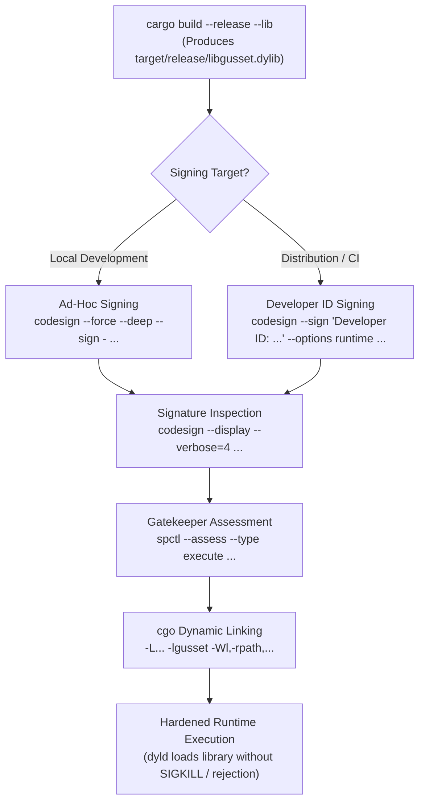

# Dynamic Library and Codesigning Guide (`docs/dylib.md`)

Gusset links statically by default (`crate-type = ["staticlib"]`) across all platforms, which eliminates runtime dynamic loader configuration (`LD_LIBRARY_PATH`, `DYLD_LIBRARY_PATH`), DLL search path hijacking, and dynamic linker version mismatch.

For adopters who require a dynamic library (`cdylib` / `.dylib` / `.so` / `.dll`), this document describes the build and codesigning steps.

---

## 1. Cargo Configuration

In `crates/gusset/Cargo.toml`:
```toml
[lib]
crate-type = ["staticlib", "cdylib"]
```

Build the dynamic library:
```bash
cargo build --release --lib
```

---

## 2. macOS Codesigning & Hardened Runtime

Under macOS Hardened Runtime, applications will refuse to load unsigned or improperly signed dynamic libraries.



### Ad-hoc signing (Development only)
```bash
codesign --force --deep --sign - target/release/libgusset.dylib
```

### Developer ID signing (Production / Distribution)
```bash
codesign --force --verify --verbose \
  --sign "Developer ID Application: Your Name (TEAM_ID)" \
  --options runtime \
  target/release/libgusset.dylib
```

Verify signature:
```bash
codesign --display --verbose=4 target/release/libgusset.dylib
spctl --assess --type execute target/release/libgusset.dylib
```

---

## 3. Go CGO Configuration for Dynamic Linking

In `internal/ffi/ffi.go`, replace static archive flags with:
```go
// #cgo darwin LDFLAGS: -L${SRCDIR}/../../target/release -lgusset
// #cgo linux LDFLAGS: -L${SRCDIR}/../../target/release -lgusset -Wl,-rpath,$ORIGIN
```
