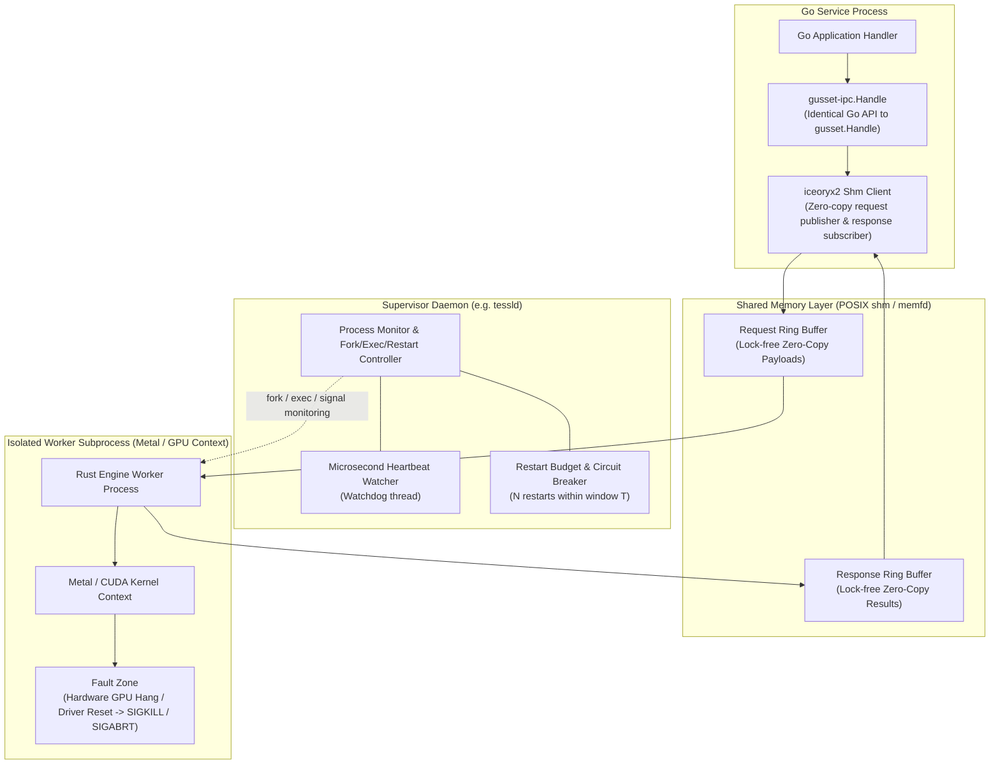
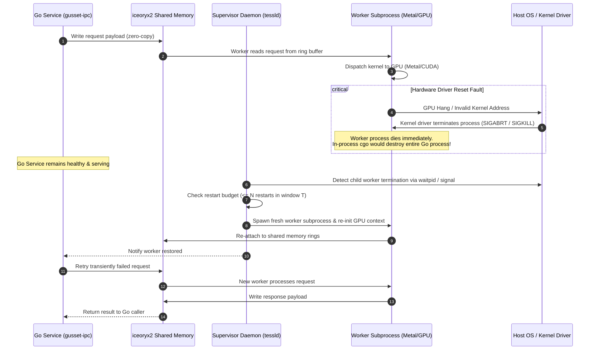

# Phase 4: Out-of-Process Crash Isolation Architecture (`gusset-ipc`)

As of 2026-09-20.

## Overview

In-process crash isolation (the Gusset runtime contract) protects against software panics, stack overflows, and concurrency faults. However, engines driving GPU hardware accelerators (such as Metal in `tessl` or CUDA kernels) can trigger hardware driver reset faults (e.g. GPU hang, memory fault in kernel space). When a driver fault occurs, the host operating system terminates the process with `SIGABRT` or `SIGKILL`, which no user-space signal handler or `catch_unwind` can survive.

For GPU workloads requiring zero-downtime serving from Go, Gusset defines the Phase 4 Out-of-Process module (`gusset-ipc`).

---

## Decision Record Summary (DECISIONS.md)

| Item | Choice | Rationale |
| :--- | :--- | :--- |
| **Transport** | `iceoryx2` upstream Go binding | Zero-copy shared memory IPC with formal distribution and maintenance from Eclipse Foundation. |
| **Adapter Role** | Thin adapter over iceoryx2 | Gusset avoids maintaining a custom shm transport. `gusset-ipc` provides the identical `gusset.Handle` Go API over IPC. |

---

## Architectural Model

## Fault Containment & Recovery Lifecycle

When driving GPU hardware, driver resets or kernel panics issue uncatchable `SIGKILL` or `SIGABRT` signals. An in-process cgo boundary cannot survive these faults; out-of-process crash isolation ensures the Go service continues uninterrupted:

---

## Daemon Supervisor Protocol

1. **Shared Memory Ring:** Requests and responses pass through bounded lock-free shared memory channels.
2. **Heartbeats:** The supervisor exchanges microsecond heartbeats with worker processes.
3. **Fault Containment:** If a Metal kernel aborts the worker, only the worker sub-process terminates. The Go service remains alive and healthy.
4. **Restart Budget:** The supervisor restarts workers up to $N$ times within window $T$. If the budget is exhausted, circuit breaker opens.
5. **Transparency:** To the Go caller, `gusset-ipc.Handle` exposes the identical `Call(ctx, in)` and `Submit`/`Wait` semantics.
