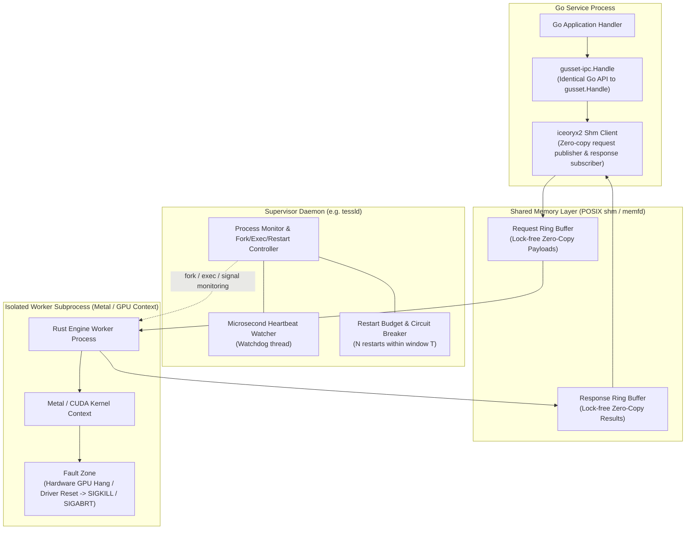
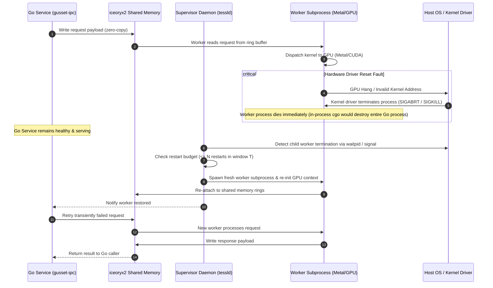

# Phase 4: Out-of-Process Crash Isolation Architecture (`gusset-ipc`)

[Documentation Hub](README.md) · [Why Gusset is Needed](why.md) · [Architecture Plan (PLAN.md)](PLAN.md)

As of 2026-09-20.

## Overview

In-process crash isolation (the Gusset runtime contract) protects against software panics, stack overflows, and concurrency faults. However, engines driving GPU hardware accelerators (such as Metal in `tessl` or CUDA kernels) can trigger hardware driver reset faults (e.g. GPU hang, memory fault in kernel space). When a driver fault occurs, the host operating system terminates the process with `SIGABRT` or `SIGKILL`, which no user-space signal handler or `catch_unwind` can survive.

For GPU workloads requiring zero-downtime serving from Go, Gusset defines the Phase 4 Out-of-Process module (`gusset-ipc`).

---

## Decision Record Summary (DECISIONS.md)

| Item | Choice | Rationale |
| :--- | :--- | :--- |
| **Transport** | `iceoryx2` upstream Go binding (still **planned** as of iceoryx2 v0.10.0, 2026-09-18) | Zero-copy shared memory IPC with formal distribution and maintenance from Eclipse Foundation. C/C++/C#/Python bindings exist; Go does not. Phase 4 cannot ship until that binding exists or Gusset contributes it upstream. |
| **Adapter Role** | Thin adapter over iceoryx2 | Gusset avoids maintaining a custom shm transport. `gusset-ipc` provides the identical `gusset.Handle` Go API over IPC. |

---

## Architectural Model

```mermaid
flowchart TD
    subgraph GoProcess ["Go Service Process"]
        App["Go Application Handler"]
        IpcHandle["gusset-ipc.Handle\n(Identical Go API to gusset.Handle)"]
        IceClient["iceoryx2 Shm Client\n(Zero-copy request publisher & response subscriber)"]
        App --> IpcHandle
        IpcHandle --> IceClient
    end

    subgraph ShmTransport ["Shared Memory Layer (POSIX shm / memfd)"]
        ReqRing["Request Ring Buffer\n(Lock-free Zero-Copy Payloads)"]
        RespRing["Response Ring Buffer\n(Lock-free Zero-Copy Results)"]
        IceClient --> ReqRing
        RespRing --> IceClient
    end

    subgraph Supervisor ["Supervisor Daemon (e.g. tessld)"]
        Monitor["Process Monitor & Fork/Exec/Restart Controller"]
        Heartbeat["Microsecond Heartbeat Watcher\n(Watchdog thread)"]
        RestartBudget["Restart Budget & Circuit Breaker\n(N restarts within window T)"]
        Monitor --- Heartbeat
        Monitor --- RestartBudget
    end

    subgraph WorkerProcess ["Isolated Worker Subprocess (Metal / GPU Context)"]
        Worker["Rust Engine Worker Process"]
        GpuCtx["Metal / CUDA Kernel Context"]
        FaultZone["Fault Zone\n(Hardware GPU Hang / Driver Reset -> SIGKILL / SIGABRT)"]
        Worker --> GpuCtx
        GpuCtx --> FaultZone
    end

    ReqRing --> Worker
    Worker --> RespRing
    Monitor -. "fork / exec / signal monitoring" .-> Worker
```

## Fault Containment & Recovery Lifecycle

When driving GPU hardware, driver resets or kernel panics issue uncatchable `SIGKILL` or `SIGABRT` signals. An in-process cgo boundary cannot survive these faults; out-of-process crash isolation ensures the Go service continues uninterrupted:

```mermaid
sequenceDiagram
    autonumber
    participant Go as Go Service (gusset-ipc)
    participant Shm as iceoryx2 Shared Memory
    participant Super as Supervisor Daemon (tessld)
    participant Worker as Worker Subprocess (Metal/GPU)
    participant OS as Host OS / Kernel Driver

    Go->>Shm: Write request payload (zero-copy)
    Shm->>Worker: Worker reads request from ring buffer
    Worker->>Worker: Dispatch kernel to GPU (Metal/CUDA)

    critical Hardware Driver Reset Fault
        Worker->>OS: GPU Hang / Invalid Kernel Address
        OS->>Worker: Kernel driver terminates process (SIGABRT / SIGKILL)
        Note over Worker: Worker process dies immediately (in-process cgo would destroy entire Go process)
    end

    Note over Go: Go Service remains healthy & serving
    Super->>OS: Detect child worker termination via waitpid / signal
    Super->>Super: Check restart budget (<= N restarts in window T)
    Super->>Worker: Spawn fresh worker subprocess & re-init GPU context
    Worker->>Shm: Re-attach to shared memory rings
    Super-->>Go: Notify worker restored
    Go->>Shm: Retry transiently failed request
    Shm->>Worker: New worker processes request
    Worker->>Shm: Write response payload
    Shm-->>Go: Return result to Go caller
```

---

## Daemon Supervisor Protocol

1. **Shared Memory Ring:** Requests and responses pass through bounded lock-free shared memory channels.
2. **Heartbeats:** The supervisor exchanges microsecond heartbeats with worker processes.
3. **Fault Containment:** If a Metal kernel aborts the worker, only the worker sub-process terminates. The Go service remains alive and healthy.
4. **Restart Budget:** The supervisor restarts workers up to N times within window T. If the budget is exhausted, circuit breaker opens.
5. **Transparency:** To the Go caller, `gusset-ipc.Handle` exposes the identical `Call(ctx, in)` and `Submit`/`Wait` semantics.

---

## Prototype (2026-10-08)

`internal/isolate` is the spike that tests point 5 before any transport work. It is internal and adds no entry point; `DECISIONS.md` 2026-10-08 records what it found.

- **Transport stand-in:** length-prefixed JSON frames on a worker's stdin and stdout, the house process contract. It copies every payload and base64-encodes it, so it says nothing about iceoryx2's cost; it exists so the API question can be answered without waiting on the binding.
- **Worker:** `isolate.Serve(stdin, stdout, handle, poolSize)` runs an ordinary `*gusset.Handle` and announces its pool size, which the host uses as its semaphore (R11).
- **Host:** `isolate.Start(ctx, cmd)` returns a `*Proc` with `Call`, `Submit`, `Wait`, `Discard` and `Close`, which are the same methods and errors as `*gusset.Handle`. Both satisfy `isolate.Caller`, and the parity tests in `internal/isolate` run every assertion against both.
- **Fault containment:** a worker that dies of SIGKILL or SIGABRT fails its in-flight tickets and every later call with an error matching `gusset.ErrPoisoned`. The host keeps running and can start a replacement. Restart budgets and heartbeats (points 2 and 4) are not prototyped.
- **Not carried:** `NewBuffer`, `CallBuffer` and `WaitBuffer`. A `*gusset.Buffer` is Rust memory in the calling process, so the out-of-process equivalent is the shared segment this document assigns to iceoryx2. `Proc.Submit` refuses a `*Buffer` with `isolate.ErrBufferUnsupported`. `TestParity_BufferInputDiverges` pins that difference. A public carrier needs three things the prototype does not decide: a third `Buffer` backing beside the Rust id and the Go-heap id 0 (`newHeapBuffer`); an ownership rule for a segment whose worker has died; and a buffer budget charged on the host side.

Run it with `go test ./internal/isolate/`.
