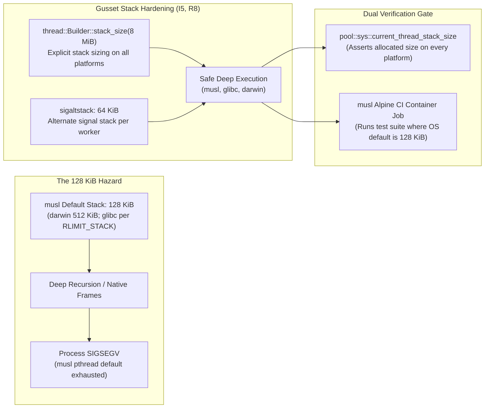
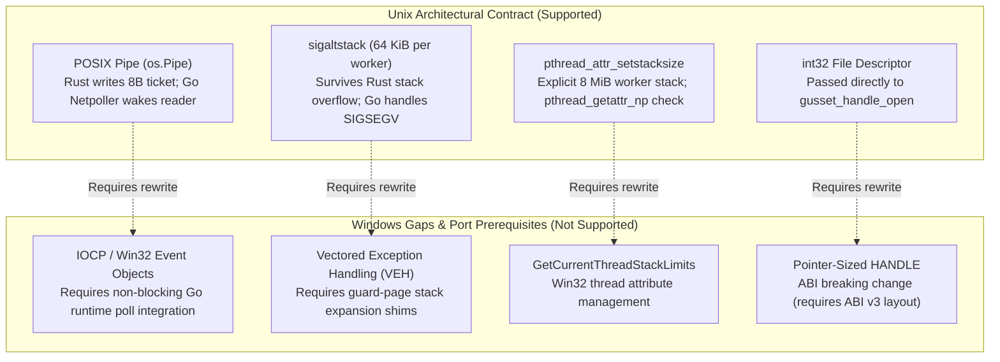

# Supported platforms

Gusset is **unix-only**. `crates/gusset/src/lib.rs` fails the build with a named
error on any non-unix target rather than letting it fail deep inside `pool::sys`
with a pile of missing `libc` symbols.

This page exists because the CI matrix used to list a `cross` job covering
`windows/amd64-gnu`, and no such job existed. A documented Windows leg that never
ran is worse than an honest "not supported": it invites an adopter to assume the
completion path works there.

## The supported set

| Target | Status | Verified by |
| :--- | :--- | :--- |
| `aarch64-apple-darwin` | supported | `unit`, `race-gc`, `soak`, `bench` |
| `x86_64-apple-darwin` | supported | `cross` (compile) |
| `x86_64-unknown-linux-gnu` | supported | `unit`, `race-gc`, `soak`, `cgocheck2`, `memlimit`, `lint`, `asan`, `miri`, `fuzz` |
| `aarch64-unknown-linux-gnu` | supported | `cross` (compile) |
| `x86_64-unknown-linux-musl` | supported | `musl` (runtime), `cross` (compile) |
| `*-pc-windows-*` | **not supported** | build fails with a named error |

`make cross` compile-checks the whole set in one command.

## Why musl has its own job

I5 and R8 say heavy Rust work runs on Rust-spawned threads with an explicit 8 MiB
stack, never on the caller's g0 stack. musl's default thread stack is 128 KiB,
against 512 KiB for secondary threads on darwin and, on glibc, whatever
`RLIMIT_STACK` says — commonly 8 MiB. A Rust thread spawned without an explicit
`stack_size` gets Rust's own std default of 2 MiB regardless of platform.

That difference is the entire reason the rule exists, and it also means a
deep-recursion test on glibc or darwin proves nothing: it passes whether or not
Gusset set the stack size, because the platform default already covers it.

Two things close that gap:

1. **`pool::sys::current_thread_stack_size`** reads the size back off the running
   worker, so `worker_stack_is_explicitly_sized_not_inherited` distinguishes "Gusset
   sized this stack" from "the platform happened to agree" on *every* platform.
   Diagnostic engine mode 8 exposes the same value end to end through the real pool.
2. **The `musl` CI job** runs the suite where the default really is 128 KiB.

A worker that ends up with less stack than requested logs it rather than degrading
silently, the same way a failed `sigaltstack` does.

## What a Windows port would have to add

Not a roadmap — a statement of scope, so the cost is visible rather than assumed:

- **Completion signalling.** The completion path is a POSIX pipe written from a
  Rust worker and read by Go's netpoller. Windows needs an IOCP or event-object
  equivalent that Go's runtime can wait on without pinning an OS thread, which is
  the property I4 depends on.
- **Signal protection.** I5 installs a 64 KiB `sigaltstack` per worker so a Rust
  stack overflow does not kill the process before Go's handler runs. Windows has
  no `sigaltstack`; the equivalent is a vectored exception handler plus a guard
  page, with different semantics.
- **Stack accounting.** `current_thread_stack_size` uses
  `pthread_get_stacksize_np` on darwin and `pthread_getattr_np` on glibc/musl.
  Windows would need `GetCurrentThreadStackLimits`.
- **Descriptor ownership.** `gusset_handle_open` takes an `int32` fd. Windows
  handles are pointer-sized, so this would be an ABI break — a new ABI version,
  not an additive change.

Until those exist, the build failing with a named error is the correct behaviour.
