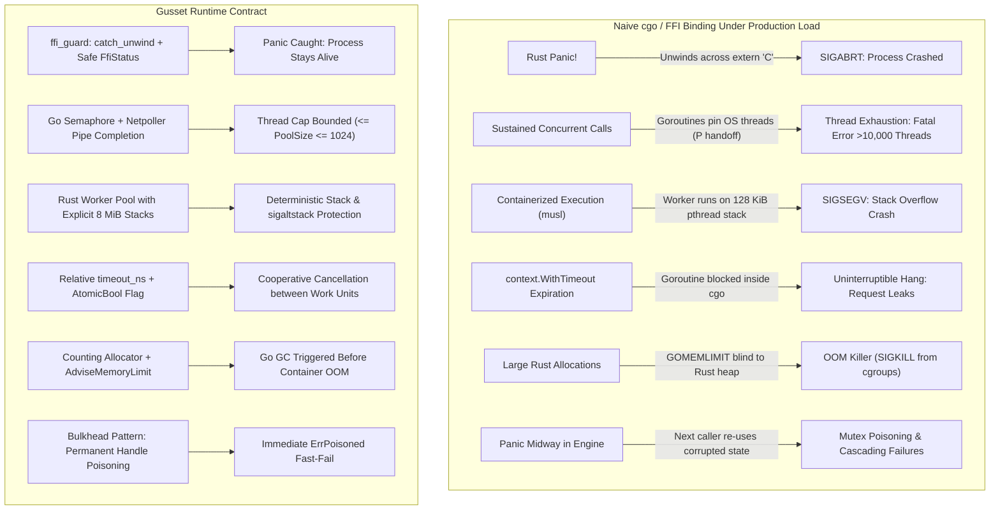

# Why Gusset is Needed: The Runtime Impedance Mismatch

"Bindings exist" is not "this runs in production without taking the Go process down."

Foreign Function Interface (FFI) generators like `cbindgen`, `cgo`, and `uniffi-bindgen-go` solve **type marshalling** and **function calling conventions**. They do not solve—and explicitly do not own—what happens when Go and Rust disagree on thread management, signal handling, memory limits, panic recovery, stack sizing, and monotonic clocks inside a single process.

Gusset is the hardened plate between the two runtimes in production.

---

## 1. The Naive FFI Illusion

In a development environment, calling a Rust function from Go through cgo looks straightforward:

```go
// Naive FFI call
result := C.my_rust_engine_process(ptr, len)
```

In production under load, this naive boundary crashes the service across six distinct failure modes:



---

## 2. The Six Runtime Collisions

### Collision 1: Failure Models & Double-Panic SIGABRT (Invariant I2)

**The Problem:**
- In Rust 1.81+, a panic escaping an `extern "C"` boundary causes an immediate, uncatchable `std::process::abort()`.
- Standard Rust code attempts to catch this with `std::panic::catch_unwind(|| ...)`.
- The catastrophic vulnerability lies in converting the panic message into an FFI-compatible string. Common implementations use `CString::new(msg).unwrap()`. If the panic payload contains an embedded `NUL` byte (e.g. raw binary bytes, slice fragments, or malformed UTF-8), `CString::new` returns an `Err`, causing `.unwrap()` to panic a *second* time inside the unwinding landing pad.
- A panic during panic unwinding is fatal: the operating system immediately aborts the process with `SIGABRT`. The entire Go backend goes down.

**How Gusset Solves It:**
- Rule R3 forbids `CString::new`, `unwrap`, and `expect` in the boundary crate.
- `ffi_guard` null-checks pointers, transfers messages as raw `(ptr, len)` without NUL-termination, and wraps error `Display` formatting in its own nested `catch_unwind`.
- Verified by Gusset's 5-case Panic Zoo suite (`tests/panic_zoo/`), which tests `&str`, `String`, non-string payloads (`panic_any(42)`), panic inside `Display`, and embedded NUL bytes.

---

### Collision 2: Concurrency & Thread Exhaustion (Invariant I4)

**The Problem:**
- Go goroutines are lightweight M:N green threads (millions can exist concurrently).
- To the Go scheduler, a cgo call is treated as a blocking system call. The operating system thread (M) is pinned to the goroutine. If the call does not return within ~20 µs, the scheduler hands off the logical processor (P) and spawns or wakes a new OS thread to service remaining goroutines.
- A burst of 1,000 goroutines calling a Rust engine simultaneously therefore grows the thread pool — but *sub-linearly*, and how far depends on how long each call blocks. On an 18-core darwin/arm64 box with ~7 ms calls, `BenchmarkThreadScaling` puts 2,048 in-flight callers in the low hundreds of OS threads rather than at 2,048: on the order of **0.1–0.2 threads per in-flight call**, because Go reuses idle Ms and `sysmon` only retakes a P from a call that has already blocked for ~20 µs. Longer calls push the ratio toward 1:1; sub-20 µs calls barely move it at all. The claim to take from this is that the count tracks **concurrency** rather than cores — not that it equals it. Exact per-concurrency figures are generated from the committed recording in [the adoption guide's measured table](choosing.md#the-measured-numbers); they are deliberately not repeated here, because a hand-typed copy goes stale at the next recording and this one already did.
- When the thread count reaches Go's hard limit (default 10,000 threads), the Go runtime fatally terminates the process:
  ```
  fatal error: runtime: program exceeds 10000-thread limit
  ```

```mermaid
sequenceDiagram
    autonumber
    participant HTTP as Inbound Requests
    participant GoSched as Go Runtime Scheduler
    participant OS as OS Threads (M)
    participant Rust as Native CGO Call

    rect rgb(255, 235, 235)
        Note over HTTP,Rust: Naive cgo: Thread Storm
        HTTP->>GoSched: Sustained concurrent goroutines
        GoSched->>OS: Every call still blocking at ~20 µs pins an M
        OS->>Rust: Block in native execution
        GoSched->>OS: sysmon hands off P; runtime wakes or spawns more Ms
        Note over OS: Count tracks concurrency, not cores.<br/>Hundreds of Ms at 2,048 in-flight 7 ms calls.<br/>The longer each call blocks, the closer to 1:1.
        OS-->>HTTP: fatal error: program exceeds 10000-thread limit
    end

    rect rgb(235, 255, 235)
        Note over HTTP,Rust: Gusset: Bounded Concurrency
        HTTP->>GoSched: Sustained concurrent goroutines
        GoSched->>GoSched: Park on Go Semaphore (permit queue)
        GoSched->>Rust: Submit work unit to bounded pool (e.g. 4 workers)
        Rust-->>GoSched: Return immediately (submit < 5 µs)
        Note over GoSched: Callers wait on netpoller pipe.<br/>Around twenty Ms at 2,048 in-flight calls,<br/>set by pool size rather than concurrency.
    end
```

**How Gusset Solves It:**
- Callers acquire a permit from a Go channel semaphore before entering cgo.
- Bounded concurrency: In-flight calls per handle can never exceed the configured pool size, capped at `gusset.MaxPoolSize` (1024). Requests exceeding the ceiling are refused, not clamped.
- Submissions are strictly non-blocking (`gusset_submit` copies or references the input and returns a ticket ID in `< 5 µs`, well below the 20 µs P-handoff threshold).
- Waiters park on Go's Netpoller via an `os.Pipe`, consuming 0 OS threads while awaiting completion.
- Verified by `TestPitfall_ThreadCapBoundedSoak` (`tests/pitfalls/pitfalls_test.go`): 500 concurrent callers against a 4-worker pool, asserting that `/sched/threads/total:threads` finishes no more than `poolSize + GOMAXPROCS + 16` above where it started. It samples after the callers drain rather than during, which is sound for exactly the reason the thread-pressure benchmark has to run one transport per process: Go never destroys an M, so the count afterwards *is* the high-water mark.

---

### Collision 3: Stack Sizing & The musl 128 KiB Trap (Invariant I5, Rule R8)

**The Problem:**
- Go goroutines run on dynamic, growable stacks that start at 2 KiB and expand on demand.
- A cgo call switches the goroutine to the host OS thread stack.
- On glibc (standard Linux) the default pthread stack is whatever `RLIMIT_STACK` says at program start — commonly 8 MiB, but 2 MiB on most architectures when that limit is unlimited. On macOS the *main* thread gets 8 MB, but secondary pthreads default to only **512 KB** ([Apple, Thread Management, Table 2-1](https://developer.apple.com/library/archive/documentation/Cocoa/Conceptual/Multithreading/CreatingThreads/CreatingThreads.html)).
- However, **`musl libc`** (the standard C library in Alpine Linux, used in millions of containerized Go deployments) specifies a default thread stack of only **128 KiB**!
- Any non-trivial Rust engine (parsers, AST traversal, deep recursion, regex compilation, or large array allocations) will exhaust 128 KiB in microseconds.
- Because static libraries do not run `std::rt::init`, Rust's stack overflow handler is absent. The process dies instantly with `SIGSEGV` before any Go recovery can intercept it.

**How Gusset Solves It:**
- Heavy work never runs on the cgo caller's thread stack.
- Gusset handles open a dedicated worker pool where every thread is spawned explicitly with `thread::Builder::new().stack_size(8 * 1024 * 1024)` (8 MiB).
- Each worker thread installs a 64 KiB `sigaltstack` in its entry function so stack overflows trigger Go's signal handler cleanly rather than crashing the thread silently.
- Verified by:
  1. `pool::sys::current_thread_stack_size`: runtime inspection on every platform that proves Gusset sized the stack rather than relying on OS defaults.
  2. Dedicated Alpine Linux (`musl`) CI container running the deep-recursion test suite.

---

### Collision 4: Deadlines, Cancellation & Monotonic Clocks (Invariant I3, Rule R9)

**The Problem:**
- In Go, cancellations are propagated cooperatively through `context.Context`.
- A goroutine blocked inside foreign C/Rust code **cannot be cancelled or preempted from Go**. If a Rust job takes 30 seconds and the HTTP client timed out after 500 ms, the server continues wasting CPU cycles until completion.
- Furthermore, monotonic clocks do not cross language boundaries:
  - Go's `time.Now()` monotonic reading is an internal process offset that is not wall-clock time.
  - macOS monotonic time uses `mach_absolute_time()` with Mach timebase conversions.
  - Linux uses `CLOCK_MONOTONIC`.
  - Comparing a Go monotonic timestamp to a Rust `std::time::Instant` produces garbage results.

**How Gusset Solves It:**
- Submit calls compute a **relative** `timeout_ns` from `ctx.Deadline() - time.Now()` at the exact moment of submission.
- The 40-byte `CallHeader` carries `timeout_ns`. Rust reads this relative offset and instantiates its own `Instant::now() + Duration::from_nanos(timeout_ns)`.
- Each job owns an `AtomicBool` cancellation flag in Rust memory. If the Go context expires, Go executes `gusset_cancel(handle, ticket)` (a sub-microsecond call) to flip the flag.
- The adopter engine checks `ctx.check()` between work units. If either the relative deadline passed or the cancellation flag was set, the engine halts immediately.
- Rust never reads Go-owned memory, avoiding cross-language memory model races.

---

### Collision 5: Two Heaps, One Memory Limit (Invariant I1, Rules R6 & R16)

**The Problem:**
- In Kubernetes, containers are assigned hard memory limits (e.g. 4 GiB). If memory exceeds the limit, the Linux OOM-killer immediately issues `SIGKILL` to the process.
- Go applications use `GOMEMLIMIT` (or `debug.SetMemoryLimit`) to ensure the garbage collector triggers aggressively before the container limit is reached.
- **Go's GC cannot see Rust allocations.** If Go has allocated 1 GiB and Rust allocates 2.8 GiB, Go believes it is well within its budget and delays GC. The container is OOM-killed while Go was completely idle.
- Furthermore, passing Go pointers to Rust that outlive the call violates Go's runtime pointer-passing contract (R6), resulting in unrecoverable `cgocheck` panics.

**How Gusset Solves It:**
- **Dual-Path Memory Model (R6/R16):** Small inputs (`<= 4 KiB`) are copied during `gusset_submit`. Larger payloads are allocated in 64-byte aligned Rust memory via `gusset_buf_alloc` and wrapped in Go as `[]byte` via `unsafe.Slice`. Go pointers never outlive the FFI call.
- **Allocator Accounting:** Gusset provides `gusset::alloc::Counting<A>`, a non-allocating wrapper around the global allocator that tracks live and peak bytes with relaxed atomics.
- **Dynamic Limit Advisory:** Go exposes `gusset.AdviseMemoryLimit(containerBudget)`, which reads live Rust memory and updates Go's `debug.SetMemoryLimit(max(budget - rustLive, floor))`, ensuring Go collects garbage proactively before the container limit is breached.

---

### Collision 6: Handle Poisoning & Mutex State Corruption (Invariant I2, Rule R10)

**The Problem:**
- If a Rust function panics midway through updating an in-memory B-tree, graph, or tensor buffer, internal state invariants are broken and standard library `Mutex` locks become poisoned.
- If the Go service simply catches the panic and continues submitting new requests to that same engine instance, subsequent calls either crash on poisoned locks (`PoisonError`), produce corrupted data, or deadlock.

**How Gusset Solves It:**
- Gusset applies the **Bulkhead Pattern** from distributed systems to in-process memory.
- If any job on a handle returns `FFI_PANIC`, the handle's atomic poison flag is latched permanently.
- All subsequent calls to that handle fail-fast with `ErrPoisoned` in Go **without ever entering native code**.
- The only remedy is for the Go caller to explicitly `Close()` the poisoned handle and open a fresh one, ensuring no corrupted state survives.

---

## 3. Comparison Matrix

| Failure Mode | Naive cgo / bindgen | uniffi-bindgen-go | rust2go | Gusset Runtime Contract |
| :--- | :--- | :--- | :--- | :--- |
| **Rust Panic Recovery** | `SIGABRT` / Crash | `catch_unwind` (vulnerable to NUL-byte abort) | `catch_unwind` | **Guaranteed**: 5-case Panic Zoo verified; `FfiStatus` ptr+len |
| **Thread Scaling** | Unbounded OS thread spawning | Unbounded OS thread spawning | Async, but disables `cgocheck` | **Bounded**: Go semaphore queue (`<= pool_size <= 1024`) |
| **musl / Docker Stack** | Crash on 128 KiB default | Crash on 128 KiB default | Dependent on host stack | **Guaranteed**: Explicit 8 MiB worker stack + `sigaltstack` |
| **Deadline Cancellation** | Hangs until native return | Hangs until native return | Async callback | **Cooperative**: Relative `timeout_ns` + `AtomicBool` flag |
| **Memory Accounting** | Go blind to Rust heap | Go blind to Rust heap | Pre-computed buffers | **Integrated**: `Counting<A>` + `AdviseMemoryLimit` |
| **GC Pointer Safety** | Easy to violate R6 | Manages copies | Forces `GODEBUG=cgocheck=0` | **Strict**: Dual-path buffer model (R6 & R16 verified) |
| **State Corruption** | Cascades or deadlocks | Unhandled | Unhandled | **Bulkhead**: Atomic handle poisoning (`ErrPoisoned`) |
| **ABI Drift Detection** | Undetected heap corruption | Checked via hash | Unchecked | **ABI v2**: Verifies version, sizes & alignments at `init()` |

---

## 4. When You Need Gusset

### You Need Gusset When:
1. **You run high-performance Rust in a Go service**: Search engines, regex/glob matching, vector indexing, parsers, cryptographic verification, compression, or ML inference embedded directly in Go HTTP/gRPC services.
2. **You deploy to containers (Docker/Kubernetes)**: You require protection against musl's 128 KiB thread stack trap and container OOM-killer termination under tight memory budgets.
3. **You serve concurrent traffic**: You cannot allow a burst of inbound requests to spawn thousands of OS threads and crash Go with `program exceeds 10000-thread limit`.
4. **Reliability is non-negotiable**: A panic in foreign code must degrade gracefully to a clean error response rather than terminating the entire binary.

### You Do Not Need Gusset When:
1. **Stateless math operations**: Trivial, microsecond C calculations that never allocate, never block, never recurse, and never panic.
2. **Separate microservices**: Workloads where network latency (`> 500 µs`) is acceptable and components run in separate processes communicating via gRPC, HTTP, or Unix domain sockets.
3. **Pure Go implementations**: Where Go's native standard library or third-party packages already meet performance requirements.

---

## 5. Language and framework landscape (verified 2026-09-20)

Gusset is a **runtime contract**, not a binding generator. The languages and frameworks below were checked against that job, not against "can I call a function".

| Surface | What it actually owns | What it does not own | Bearing on Gusset |
| :--- | :--- | :--- | :--- |
| **Go 1.27** | `goroutineleak` profile is GA (`runtime/pprof` + `/debug/pprof/goroutineleak`). `runtime/metrics` publishes `/sched/threads/total:threads` and `/sched/goroutines/not-in-go:goroutines` (cgo/syscall). Green Tea GC remains default from 1.26. | Recovering a panic that escaped `extern "C"`; seeing the Rust heap | Soak asserts the thread metric. Leak profile is the empty-after-drain gate. Heap-base randomization (1.26) still forbids pointer-value tests. |
| **Rust 1.81+ (current develop: 1.98.x)** | Uncaught panic out of `extern "C"` **aborts**. `catch_unwind` only catches unwinding panics, not `panic=abort`, not C++ exceptions (unspecified: abort or opaque `Err`). `"C-unwind"` is the ABI that *intends* to unwind. | Go's scheduler, `GOMEMLIMIT`, SIGSEGV ownership in a `staticlib` | R2 forces `panic = "unwind"` at build time. Firewall is `catch_unwind` around the **work unit**, not hope that `extern "C"` is recoverable. Abort and GPU driver faults stay Phase 4. |
| **cgo (this process)** | `#cgo noescape`/`nocallback` (Go 1.22+); ~20 µs P-handoff; `KeepAlive`; `AddCleanup` | A cross-language memory model; cancelling a call already inside C | Submit-and-return keeps every cgo call under the hand-off. The seed blocking no-op is **18.4 ns** on the current toolchain (Go 1.27.1 / Rust 1.98.0, darwin/arm64) and was **64 ns** on the older x86-64 Linux host, so the commonly quoted "~40 ns cgo call" brackets the range rather than describing it — and the cheaper the raw call gets, the larger Gusset's ratio, not the smaller. Gusset's no-op is **20.09 µs ± 11%**, roughly 1,100x the raw call, because the work is on a Rust worker and the waiter parks on `os.Pipe`. That gap is the product, not a regression: it buys the firewall, the deadline and the bounded thread count, and `docs/img/crossover.svg` shows where real work amortises it. |
| **rust2go** | Rust-driving-Go async, generated bindings, optional ASM callbacks | Production cgocheck | README still tells callers to set `GODEBUG=invalidptr=0,cgocheck=0`. Issue #109 (open as of 2026-03-28) asks when that is required. Gusset refuses both flags in CI. |
| **uniffi-bindgen-go** | Type marshalling, `RustBuffer` shape, generated Go | Panic firewall, pool, deadlines, poison | Sit *on top* of Gusset. Adopter example is staticlink; UniFFI's default dynamic load still needs `LD_LIBRARY_PATH`. |
| **purego / Stoolap `asmcgocall`** | `CGO_ENABLED=0` containers | A supported calling convention | `asmcgocall` skips `entersyscall`; P stays pinned; STW waits. R13. Stoolap is honest that a Go minor can break it. |
| **Wasm sandboxes** (wazero, Wasmtime, Extism) | A real fault domain *inside* the process: a trap, an out-of-bounds access or an abort is contained by the runtime, with a capability-scoped host interface | Native speed; running an existing native library unmodified | The honest alternative to Gusset's fault-domain trade-off, and the reason it is a trade-off rather than a win. 2026 measurements put **Wasmtime at 2.41x native and wazero at 4.72x** on compute-bound work, and every payload crosses a linear-memory copy. Gusset keeps native speed and gives up in-process fault isolation; Wasm takes the inverse trade. An engine that can genuinely fault — a GPU driver, an unaudited C dependency — wants one of these or Phase 4, not Gusset. |
| **iceoryx2 v0.10.0** (PyPI 2026-09-18) | Lock-free zero-copy IPC, C/C++/C#/Python bindings, claimed sub-µs latency independent of payload | A Go binding | Language table still lists **Go as planned**. Phase 4 remains specified, not implemented. In-process Gusset cannot survive `SIGKILL` from a GPU driver reset. |
| **Java FFM (JEP 454, Java 22+)** | Bounded off-heap `MemorySegment`, linker without JNI glue | Go services | The analogous *other-runtime* hardening: deterministic native lifetime, fail-loud bounds. Not a substitute. |
| **Zig 0.15.1** (0.15.0 retracted) | First-class C ABI (`export fn`, `callconv(.C)`), `zig cc` for musl | A Go runtime contract | A Zig engine could sit behind Gusset's existing 14 C exports. It does not replace the Go-side semaphore, pipe, or poison latch. |
| **Swift C++ interop** | In-process Swift↔C++ | Go, cgo, POSIX completion | Irrelevant to this binary. Same C ABI lesson: callbacks must not run on the foreign thread that cannot hop the main actor — the Gusset dual of "Rust never calls Go" (R5). |

Handle and communication, at the language level:

1. **Go `Handle`** is a GC object with an explicit `Close`, a bounded semaphore, and a dispatch goroutine parked on the netpoller. `AddCleanup` is a leak backstop, not the contract.
2. **Rust `Handle`** is an `Arc` over a fixed worker pool, a results map, a buffer map, and a non-blocking pipe write fd. `Drop` joins workers; Go `HandleClose` is what actually drops it.
3. **The only shared addresses** are Rust-owned (`Buffer`, cancel `AtomicBool`, status strings). Every cross-boundary value is copied into the 40-byte header or returned through `gusset_take`.
4. **Clocks do not cross.** Go computes relative `timeout_ns`; Rust builds its own `Instant`. Overflow of that add is expiry, not infinity.
5. **Upcoming runtimes** (Go tip weekly, Rust nightly monthly) are gates, never shipped code. A boundary-behaviour change is a version-gated path plus a test, not a raised floor.

